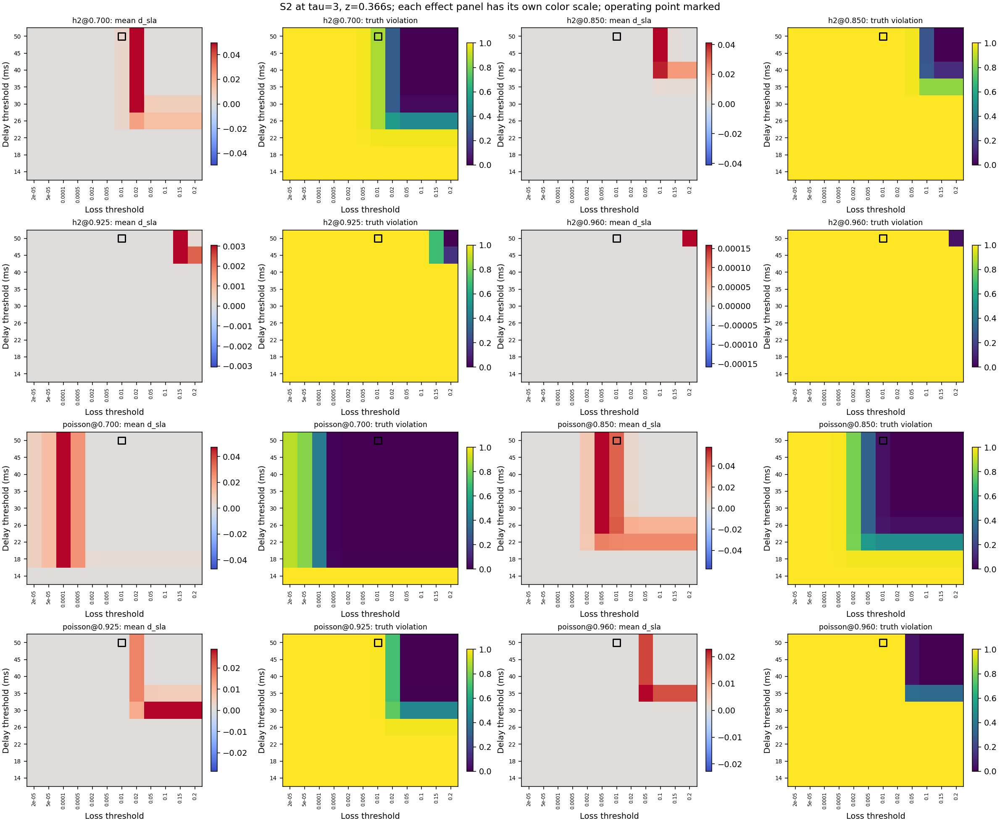

# 20R2.9-B — báo cáo thi công và kết quả tái lập

Ngày 2026-09-14. Hoàn thành S1, S3 và chiến dịch S2 đủ **320/320 lượt, 449.280 hàng raw**, sau khi ký và push cách đọc/kế hoạch. Mọi đối chứng ngưỡng đồng nhất đạt sai số **0**. Bộ pytest mặc định còn đúng **hai lỗi có sẵn từ A**, không phát sinh lỗi mới trong lần kiểm này. Bước đóng-v2 chưa thực hiện.

## Đã làm gì

| Phần | Thực hiện | File chính |
|---|---|---|
| B-0 | Cố định cách đọc; ghi rõ tái lập có biết kết quả mẫu, các đính chính CI/ULP/Jensen/phạm vi | [B0](B0-reading-signed.md) |
| S1 | Tích phân Gaussian tất định, đo cặp đường theo ba seed, giải SNR* và nhãn cho từng ô/τ | [B1 JSON](B1-omega-sensitivity.json), [CSV 64 hàng](B-validation/S1-per-cell-tau.csv) |
| S2 | Thêm sla_grid tùy chọn; giữ đường/RNG/cửa sổ chấm gốc; tái dùng runner có fsync, guard, resume kiểm hash và cách ly mồ côi | [kế hoạch](B2-run-plan.json), [sổ chạy](B2-campaign-log.jsonl), [kết quả](B2-sla-threshold-map.json) |
| S3 | Tích phân err(z) theo hai generator tuổi cơ sở thật; kiểm shared-z từng seed, Jensen và phân rã đại số | [B3 JSON](B3-axis-marginal.json), [CSV 64 hàng](B-validation/S3-per-cell-tau.csv) |
| B-4 | Đăng ký hai estimand, bổ sung G1/G4/RQ-e và tự chấm; truy vết INV-01 | [GLOSSARY](../GLOSSARY.md), [phụ lục giới hạn](B4-limit-update.md) |

Nguồn thi công: `tools/20r2_9_omega_sensitivity.py`, `tools/20r2_9_axis_marginal.py`, `tools/20r2_9_s2_{plan,worker,run,summarize}.py`, `tools/sensitivity_20r2.py`; bản vá sản xuất ở `measurements/decision_error_v2.py::run_cell`. Đối chứng ở `test/test_20r2_9_sensitivity.py` và `test/test_20r2_9_s2.py`.

## Số đo trên màn hình

S1 là ước lượng có điều kiện của mô hình Gaussian hai đường; không phải phép đo tải chung mạng hoặc cận đã chứng minh cho bốn đường. Bảng giữ từng ô; S3 tại τ=3 là lát cắt, không thay bảng đủ tám τ.

| Ô | S1: ratio tại ω=.10, min–max qua 8 τ | Nhạy / 8 τ | S3: E_err legacy → measured tại τ=3 | Tỷ số trục |
|---|---:|---:|---:|---:|
| h2@0.700 | 1.001586–1.001752 | 0/8 | 0.18329264 → 0.20303832 | 1.107728 |
| h2@0.850 | 1.008001–1.008834 | 0/8 | 0.16348525 → 0.18054759 | 1.104366 |
| h2@0.925 | 1.061817–1.067967 | 0/8 | 0.05105557 → 0.05622762 | 1.101302 |
| h2@0.960 | 1.376625–1.406127 | 8/8 | 0.00129575 → 0.00135028 | 1.042086 |
| poisson@0.700 | 1.003788–1.004184 | 0/8 | 0.14437847 → 0.15831395 | 1.096520 |
| poisson@0.850 | 1.000050–1.000055 | 0/8 | 0.20648448 → 0.22883231 | 1.108230 |
| poisson@0.925 | 1.000759–1.000838 | 0/8 | 0.17675735 → 0.19582761 | 1.107889 |
| poisson@0.960 | 1.008541–1.009430 | 0/8 | 0.12027388 → 0.13351220 | 1.110068 |

S1: ngưỡng SNR*=**2.575323556** tại τ=3; không hàng nào ở biên ±10%. Cặp P1–P3 ổn định 3/3 seed trên mỗi ô. Cả hai ô rho=.960 tiếp tục chịu T2-R7.

S2: dưới đây là mean của năm seed tại τ=3, z=.366. Cột max là cực trị mô tả trên lưới đã ký, **không phải một ngưỡng vận hành mới hoặc kiểm định ý nghĩa thống kê**.

| Ô, τ=3, z=.366 | d_sla tại (50ms,1%) | Truth tại điểm vận hành | Max abs(mean d_sla) có dấu trên 108 ngưỡng | Ngưỡng đạt max (ms, loss) |
|---|---:|---:|---:|---|
| h2@0.700 | 0.00538956 | 0.87261647 | 0.04947992 | (35, 0.02) |
| h2@0.850 | 0.00000000 | 1.00000000 | 0.04103414 | (45, 0.1) |
| h2@0.925 | 0.00000000 | 1.00000000 | 0.00305321 | (45, 0.15) |
| h2@0.960 | 0.00000000 | 1.00000000 | 0.00015863 | (50, 0.2) |
| poisson@0.700 | 0.00000000 | 0.00000000 | 0.04715663 | (18, 0.0001) |
| poisson@0.850 | 0.04272088 | 0.04431627 | 0.05781827 | (30, 0.005) |
| poisson@0.925 | 0.00001004 | 0.99432430 | 0.02871586 | (30, 0.05) |
| poisson@0.960 | 0.00000000 | 1.00000000 | 0.02270984 | (35, 0.05) |

[PDF tám trang](B2-sla-threshold-maps.pdf) có đủ tám τ cho từng ô, cặp bản đồ d_sla/truth; ô vuông đánh dấu điểm (50ms,1%). Thang màu hiệu ứng riêng từng panel. [Bảng Parquet 89.856 hàng mean seed](B-validation/S2-threshold-seed-means.parquet) giữ đủ 13 z và min/max qua seed. Raw gồm 320 Parquet cùng 320 sidecar dưới `results/PENDING/phase-20R2-B/S2/`.

S3: shared-z **1.280 hàng, max|diff|=0** trước gộp seed; mọi mass_outside=0. Tuổi trung bình legacy=.3025s, measured=.3660396s (một triệu bước mỗi trục, dt=.005). Sai số đồng nhất phân rã tối đa **2.22e-16** ở mean seed, **4.44e-16** ở seed có mẫu số dương. `h2@0.960, τ=20, seed103` có tỷ số không xác định vì mẫu số 0; giữ nguyên seed và null trong artifact. Một số Jensen gap dương; dấu không chứng minh lồi/lõm toàn miền. Không dùng trung vị gộp tám ô hoặc gọi shape là hiệu ứng nhân quả độc lập.

## Chạy và đo tài nguyên

- S2: **320/320 lượt thành công**; 449.280 hàng raw → 89.856 hàng mean năm seed.
- 4,160 đối chứng tại ngưỡng gốc: sai số tối đa **0**; mọi trường per_z chung với chiến dịch gốc khớp tuyệt đối.
- Tổng thời gian subprocess worker: **2473.82s = 41.23 phút**. Từ env receipt đến completion cuối: **16712.00s = 278.53 phút**. Ước tính 68 phút trong hướng dẫn không được trình bày như số đo.
- Chiến dịch bị ngắt sau 244 lượt thành công, rồi resume ở đúng commit/môi trường đã ký sau khi kiểm hash các kết quả cũ. Khoảng thời gian theo timestamp gồm thời gian gián đoạn phiên; tổng worker chỉ cộng các lượt có completion, không phải tổng CPU hay thời gian của lượt bị ngắt. Các run_start được giữ nguyên trong ledger.
- RSS đỉnh worker: **627064 KiB = 612.37 MiB**. Đây là toàn worker, không chỉ mảng vi phạm. Máy còn có tác vụ chẩn đoán/kiểm metadata nhẹ trong lúc chiến dịch chạy; thời gian này không phải benchmark trên máy độc chiếm.
- Môi trường, seed, n, lệnh, hash raw/sidecar và timestamp từng lượt được lưu trong [ledger](B2-campaign-log.jsonl); stdout ở [S2-campaign.log](B-validation/S2-campaign.log).

## Kiểm thử và tự chấm

Kiểm bản vá cùng nhóm hồi quy liên quan: **225 passed**. Nhóm tích hợp công cụ/nguồn/CLI: **478 passed, 101 skipped**. Số đo cuối từ lệnh mặc định `python -m pytest -q`: **2 failed, 5197 passed, 210 skipped, 13 deselected, 2 warnings trong 884.39s**. Phạm vi marker mặc định bỏ slow/custody theo pytest.ini; không gọi đây là bộ mọi marker.

| Gate B | Kết quả và phạm vi |
|---|---|
| B-1 | PASS: reading tag được push trước các phép tái lập; plan tag trước S2. Đây không phải đăng ký mù trước dữ liệu mẫu. |
| B-2 | PASS: 64 hàng S1, cặp đường thực theo seed, SNR* và vùng biên; có giới hạn mô hình. |
| B-3 | PASS: default cũ so với source trước vá khớp; thêm đối chứng đồng nhất không tầm thường; đủ 4.160 identity bằng 0 và hai estimand đăng ký riêng. |
| B-4 | PASS trong phạm vi S3 đã ký: shared-z từng seed, khối lượng ngoài miền, gap và phân rã; công khai tỷ số không xác định. |
| B-5 | PASS: kiểm hash đầu vào/nguồn/plan/raw/sidecar/bảng/hình; 5522 file khoa học có trước B giữ nguyên. |

[Log pytest đầy đủ](B-validation/pytest-default.log), [so sánh với A](B-validation/suite-comparison.json), [kiểm nguồn và bảo toàn](B-validation/provenance-and-preservation.json). Hai lỗi còn lại:

1. `test_known_dangling_only_shrinks`: bảy Parquet local thiếu digest lịch sử, không thêm miễn trừ.
2. `test_G23_225_canonical_input_preserves_published_numbers[g23-17c]`: giữ test/số công bố; INV-01 mở. [Truy vết](B-validation/INV01-floating-point-trace.json) và [can thiệp cách cộng](B-validation/INV01-reduction-propagation.json) tái lập 8/8 trường lệch bằng fsum/n, nhưng chưa chứng minh danh tính input/thứ tự cộng lịch sử.

B không thay phán quyết 5/8, gate6a còn FAIL_PARTIAL từ A, gate7 còn chuyển 21R2 và hạn chế T2-R7. G1 được lượng hóa độ nhạy có điều kiện; đo tải chung thực vẫn là nợ mở.

## Mốc ký và lệnh tái lập

- `phase-20R2-B-reading-signed`: `33489835f2d0bbf7f140873608f997f8568785d4`.
- `phase-20R2-B2-plan-signed`: `95d7bb7c9491b6405eb1fb67467bf40f204ffcbc`.
- Giữ nguyên tag cũ `phase-20R2-closed` tại `042c58f4dd20dc6f7b78cdfe7f3473a6e3745ffb`.

[Lệnh đã chạy và cách dùng file kết quả](B-validation/commands.txt). Các công cụ đo từ chối ghi đè artifact; chạy lại cần đường output mới và tuân thủ signed plan/guard. Không force-move tag để làm lại bằng chứng.
