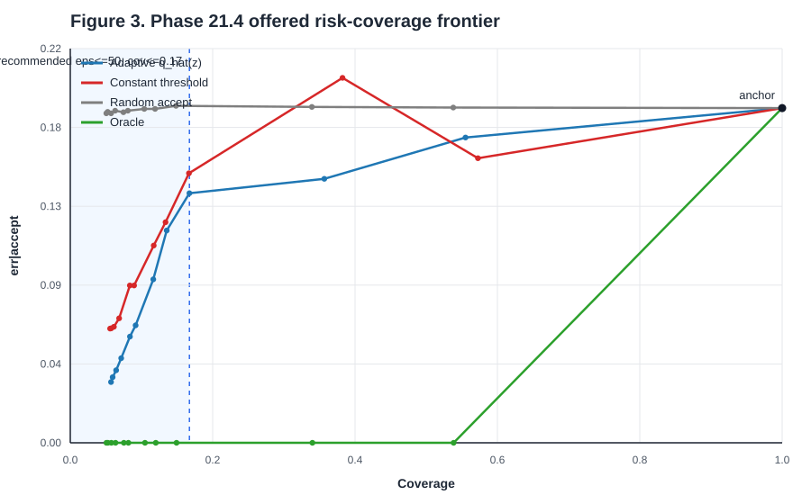

# PHASE 21.4 - Usefulness Ablation

Ngay chay: 2026-07-28
Script: `cert/usefulness.py`
Figure: `docs/phase-21/fig3-usefulness.svg`

## 1. Cau Hoi

Lesson 21.3 cho thay conformal trust gate co risk-coverage OOS tot. Lesson 21.4
kiem tra ablation reviewer se hoi dau tien:

```text
Neu thay q_hat(z) bang mot nguong hang so c tren gap_twin, ket qua co con tot?
```

So sanh cong bang:

```text
adaptive: gap_twin >= q_hat(z) - eps
constant: gap_twin >= c
```

Voi moi `eps`, `c` duoc chon tren `D_CALIB` de khop coverage calibration cua
adaptive gate. Ca hai duong duoc danh gia tren `D_TEST`. CI la paired block
bootstrap tren test block voi common random numbers.

## 2. Offered Primary

Provenance:

```text
git_hash  = 7fc60a665a88b5385acddc26b63ff7b3b6bc9ed9
git_dirty = false
q_hat(z)  = [64.11, 88.80, 105.90, 120.17, 133.20]
anchor    = cov 1.0000, err 0.1868, d_sla 0.08100, regret 6.280 ms
```



### 2.1. Ablation B2

`delta = err_const - err_adaptive`; `**` nghia la CI95 cua delta nam hoan toan
tren 0, adaptive thang chac chan.

```text
  eps  cov_ad  err_ad  cov_c  err_c    delta CI95
    0  0.0573  0.0339 0.0560 0.0637  +0.0298 [+0.0197,+0.0412] **
    2  0.0595  0.0366 0.0575 0.0639  +0.0274 [+0.0179,+0.0383] **
    5  0.0644  0.0405 0.0613 0.0647  +0.0245 [+0.0146,+0.0349] **
   10  0.0715  0.0472 0.0686 0.0695  +0.0224 [+0.0126,+0.0318] **
   15  0.0838  0.0593 0.0837 0.0878  +0.0286 [+0.0178,+0.0407] **
   20  0.0918  0.0656 0.0896 0.0878  +0.0224 [+0.0126,+0.0333] **
   30  0.1166  0.0912 0.1173 0.1101  +0.0188 [+0.0093,+0.0288] **
   40  0.1354  0.1185 0.1338 0.1231  +0.0046 [-0.0040,+0.0130]
   50  0.1674  0.1393 0.1667 0.1504  +0.0112 [+0.0028,+0.0194] **
   70  0.3569  0.1473 0.3824 0.2037  +0.0566 [+0.0469,+0.0671] **
  100  0.5551  0.1704 0.5726 0.1588  -0.0114 [-0.0174,-0.0052]
  140  1.0000  0.1868 1.0000 0.1868  +0.0000 [+0.0000,+0.0000]
  200  1.0000  0.1868 1.0000 0.1868  +0.0000 [+0.0000,+0.0000]
```

Ket qua chinh:

```text
adaptive thang chac chan o 9/13 muc eps
adaptive TROI HOAN TOAN o 8/11 muc eps khong suy bien:
  eps = 0, 2, 5, 10, 15, 20, 40, 50
```

Dieu nay tra loi cau hoi reviewer: dieu kien-theo-tuoi `q_hat(z)` khong phai
trang tri. No giam `err|accept` so voi threshold hang so o hau het vung coverage
van hanh quan trong.

Dang manh hon cua ket qua la "troi hoan toan": tai 8/11 diem van hanh khong
suy bien, adaptive gate co coverage cao hon va `err|accept` thap hon cung luc.
Do khong chi la mot danh doi tot hon tren cung mot duong cong.

So tai coverage khop, noi suy tu duong constant threshold:

```text
coverage   err_adaptive   err_constant@coverage   ti le
 0.0573       0.0339             0.0639           1.88x
 0.0644       0.0405             0.0668           1.65x
 0.0838       0.0593             0.0878           1.48x
 0.1166       0.0912             0.1096           1.20x
```

Cau tom tat cho paper:

```text
At matched coverage the age-conditional certificate reduces decision error by
1.9x relative to a constant confidence-margin threshold calibrated to the same
acceptance rate: 3.4% vs 6.4% at 5.7% coverage. The paired block-bootstrap
CI95 for the error difference is [+0.020, +0.041]. Adaptive q_hat(z) strictly
dominates the constant threshold at 8 of 11 pre-registered non-degenerate
operating points.
```

### 2.2. Bon Duong Co So

```text
  eps     cov | adaptive constant random oracle
    0  0.0573 |   0.0339   0.0637 0.1839 0.0000
    2  0.0595 |   0.0366   0.0639 0.1847 0.0000
    5  0.0644 |   0.0405   0.0647 0.1839 0.0000
   10  0.0715 |   0.0472   0.0695 0.1854 0.0000
   15  0.0838 |   0.0593   0.0878 0.1845 0.0000
   20  0.0918 |   0.0656   0.0878 0.1853 0.0000
   30  0.1166 |   0.0912   0.1101 0.1863 0.0000
   40  0.1354 |   0.1185   0.1231 0.1864 0.0000
   50  0.1674 |   0.1393   0.1504 0.1881 0.0000
   70  0.3569 |   0.1473   0.2037 0.1874 0.0000
  100  0.5551 |   0.1704   0.1588 0.1871 0.0000
  140  1.0000 |   0.1868   0.1868 0.1868 0.1868
  200  1.0000 |   0.1868   0.1868 0.1868 0.1868
```

Random nam gan anchor 0.1868 tren moi coverage, dung nhu B1. Oracle co err = 0
den cac coverage da quet duoi 0.8132; khi eps lon lam coverage = 1.0, oracle
bat buoc nhan ca diem sai nen tro ve anchor.

### 2.3. Du Dia Oracle Khai Thac Duoc

```text
eps   coverage   exploited headroom
  0     0.0573      81.6%
  2     0.0595      80.2%
  5     0.0644      78.0%
 10     0.0715      74.5%
 15     0.0838      67.9%
 20     0.0918      64.6%
```

O vung coverage thap, adaptive gate khai thac 64.6-81.6% du dia giua random va
oracle. Day la dong gop hieu nang, khong chi la bao dam hinh thuc.

### 2.4. Dao Chieu O Epsilon Lon

Khong cat bang tai `eps=50`. Ket qua co mot hien tuong co co che ro:

```text
eps = 100: adaptive err 0.1704 | constant err 0.1588
           delta -0.0114, CI95 [-0.0174,-0.0052]
```

Cong constant thang co y nghia o `eps=100`. Day la khiem khuyet cua ho tham so
hoa dang cong, khong phai bang chung chong lai dieu kien-theo-tuoi. Nguong hieu
dung la `max(q_hat(z) - eps, 0)` vi `gap_twin` khong am:

```text
eps =  40: [24.1, 48.8, 65.9, 80.2, 93.2] -> 0/5 bin thoai hoa
eps =  50: [14.1, 38.8, 55.9, 70.2, 83.2] -> 0/5 bin thoai hoa
eps =  70: [ 0.0, 18.8, 35.9, 50.2, 63.2] -> 1/5 bin thoai hoa
eps = 100: [ 0.0,  0.0,  5.9, 20.2, 33.2] -> 2/5 bin thoai hoa
```

Khi `q_hat(z) - eps <= 0`, bin do accept moi hang, ke ca `gap_twin ~= 0`, noi
hai hanh dong gan hoa va twin de chon sai nhat. Cong adaptive khi do vut bo tin
hieu bien do trong cac bin cham 0, trong khi constant threshold van giu tin
hieu `gap_twin`.

Pham vi van hanh khuyen nghi:

```text
eps <= 50 ms, tuong ung coverage <= 0.17 tren offered OOS
```

Trong vung nay adaptive gate troi hoan toan hoac thang co y nghia, va chua co
bin nao thoai hoa.

### 2.5. Exploratory Cho Phase 23

Quan sat hau nghiem nay de xuat mot ho tham so hoa nhan:

```text
gap_twin >= lambda * q_hat(z),  lambda in [0, 1]
```

Ho nhan giu nguyen thu tu giua cac bin va khong lam bin tuoi tre cham nguong 0
som hon bin tuoi gia:

```text
lambda = 0.9: [57.7, 79.9, 95.3, 108.2, 119.9]
lambda = 0.5: [32.1, 44.4, 53.0,  60.1,  66.6]
lambda = 0.1: [ 6.4,  8.9, 10.6,  12.0,  13.3]
```

Khong chay ho nhan trong Phase 21. Day la exploratory/future work va can duoc
pre-register o dau Phase 23 truoc khi do.

## 3. Measured Robustness

Provenance:

```text
git_hash  = 6e1fa9178d04703c12c526eb581482b895c937af
git_dirty = false
q_hat(z)  = [68.63, 103.02]
anchor    = cov 1.0000, err 0.1722, d_sla 0.07337, regret 5.316 ms
```

Measured co it mau hon va chi co 2 bin tuoi, nhung ket qua van ung ho du doan o
vung coverage thap:

```text
adaptive thang chac chan o 6/13 muc eps
```

```text
  eps  cov_ad  err_ad  cov_c  err_c    delta CI95
    0  0.0742  0.0550 0.0767 0.0689  +0.0141 [+0.0037,+0.0254] **
    2  0.0777  0.0586 0.0804 0.0691  +0.0106 [+0.0013,+0.0207] **
    5  0.0842  0.0604 0.0833 0.0723  +0.0121 [+0.0010,+0.0233] **
   10  0.0950  0.0712 0.0979 0.0841  +0.0131 [+0.0009,+0.0256] **
   15  0.1029  0.0761 0.1033 0.0868  +0.0109 [+0.0007,+0.0218] **
   20  0.1096  0.0812 0.1141 0.0915  +0.0102 [+0.0010,+0.0199] **
   30  0.1425  0.1161 0.1404 0.1134  -0.0029 [-0.0137,+0.0087]
   40  0.1611  0.1313 0.1566 0.1154  -0.0160 [-0.0275,-0.0044]
   50  0.1865  0.1525 0.1874 0.1579  +0.0053 [-0.0043,+0.0148]
   70  0.5783  0.1467 0.5882 0.1357  -0.0109 [-0.0184,-0.0032]
  100  0.6071  0.1601 0.6110 0.1365  -0.0234 [-0.0300,-0.0165]
  140  1.0000  0.1722 1.0000 0.1722  +0.0000 [+0.0000,+0.0000]
  200  1.0000  0.1722 1.0000 0.1722  +0.0000 [+0.0000,+0.0000]
```

Du dia oracle khai thac o 6 muc eps dau:

```text
68.5%, 66.3%, 64.4%, 57.3%, 54.0%, 50.1%
```

Measured la robustness only. No ung ho dong gop cua dieu kien-theo-tuoi o vung
coverage thap, nhung khong manh bang offered va khong thay the source chinh.
Day la internal consistency check dung huong: measured chi co 2 bin tuoi nen
loi ich dieu kien hoa giam so voi offered 5 bin.

```text
offered : 5 bin, thang 9/13, delta eps=0 +0.0298, exploited headroom 81.6%
measured: 2 bin, thang 6/13, delta eps=0 +0.0141, exploited headroom 68.5%
```

Dao chieu xuat hien som hon tren measured (`eps=40`) vi chi co 2 bin tuoi va ho
dang cong nhanh lam bin tre thoai hoa.

## 4. Ket Luan Lesson 21.4

Checklist:

```text
Amendment 4 truoc khi do                         PASS
B2 ablation co CI95 cua hieu                     PASS
Bon duong co so                                  PASS
Figure 3 cung truc risk-coverage                 PASS
Figure 3 co du 4 duong va vung eps<=50           PASS
offered adaptive thang >= 6/13 muc eps           PASS (9/13)
offered troi hoan toan tren diem khong suy bien  PASS (8/11)
measured robustness                              PASS (6/13)
pytest                                           PASS (84 passed, 4 skipped)
```

Ket luan dua vao Gate 21: Phase 21 co dong gop phuong phap. Conformal gate
khong chi la threshold tren `gap_twin`; Mondrian `q_hat(z)` lam giam loi chap
nhan so voi constant threshold, nhat la o vung coverage van hanh thap.
