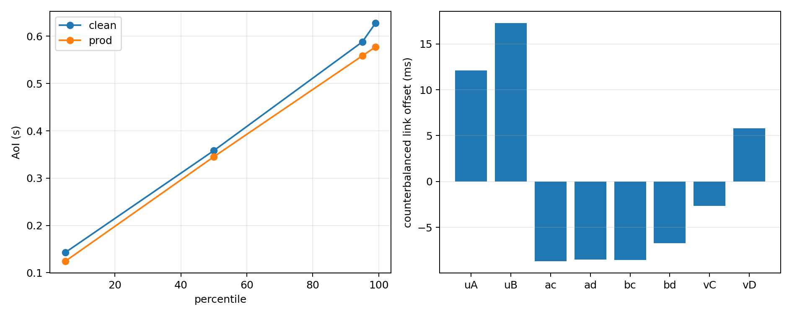

# Lesson 23.8[A1--A5] -- AoI tren topology_v7

Ngay: 2026-08-22  
Ket qua: **A4 hoan tat 30/30; controls PASS; sawtooth shape gate MISS;
P23-A/L11/L13 chua dong va khong nap lai tham so.**

## 1. Da lam gi

1. Tao spec Ditto rieng cho topology_v7 (6 host, 6 switch, 8 physical link,
   1 path va controller), mot mapping duy nhat giua ten T7 va Thing ID, test
   thu tu link, bootstrap va verify truc tiep.
2. Noi `sync_agent` vao `run_sync_v7` bang thread co `RLock`, truyen period
   0.5 s tuong minh, loc chi 20 Thing host/switch/physical-link trong spec,
   va dung thread sach khi Mininet thoat.
3. Them dau do GET rieng tung Thing: `t_obs` rieng, khong clip AoI am, dao
   fwd/rev moi probe, ghi `read_pos`, rho va header tu mo ta.
4. Dong bang schema/runner va Amendment 23-43 tai tag
   `lesson-23.8a4-pre`, roi random hoa 30 run bang seed 23843.
5. Khi run 4 preflight that bai vi vector model co rho link >1, ghi Amendment
   23-43a va tag `lesson-23.8a4-rho-fix` truoc khi co outcome rho=0.960.
   Phep chieu moi giu mean rho_bar, cap moi link o 0.995; ba run hop le truoc
   do khong chay lai.

## 2. Quy mo va bang chung chay

```text
Design             2 mode x 5 rho_bar x 3 repeat = 30 run
Duration           120 s/run
Probe interval     0.1 s, fwd/rev xen ke
Run complete       30/30
AoI observations   287,760 (143,880/mode)
Sync cycles        7,323 (CLEAN 3,661; PROD 3,662)
Raw artifacts      427 MiB trong results/phase-23/aoi_v7_campaign/
Negative AoI       0
Overall overrun    0.4506%
Max per-run overrun 0.8197%
Lock wait P95      0.00358 ms
Post-campaign test 1,062 passed; 5 skipped; 8 deselected; 0 failed
```

Git hash trong header co hai gia tri dung nhu audit trail:

```text
71cd5248...  ba run dau, truoc Amendment 23-43a
f4a3914e...  27 run con lai, sau phep chieu rho vat ly
```

SHA-256 spec cua ca 30 header giong nhau:
`557b7c296c6ce5dd88d9169fcf7f9d6e6836d5cb69474a3ed74122ae1c1b53b8`.

## 3. Controls

| Control | So do | Ket qua |
|---|---:|---|
| NC-R | beta CLEAN = -1.6447 +/- 0.1777 ms/position; t=-9.256; rank 9/9 | PASS |
| NC-S | AoI am = 0/287,760 | PASS |
| NC-T | overrun = 0.004506 < 0.05 | PASS |
| NC-U | CLEAN full-push 20/20 trong moi cycle | PASS |
| NC-V | 1 SHA-256 spec duy nhat | PASS |

Beta am khong bi xoa: counterbalancing cho thay artifact thu tu doc la co y
nghia thong ke. Dau am co the xuat hien vi reader va sync chay dong thoi; dieu
quan trong cho E3 la ma tran full-rank va beta duoc tach khoi alpha link.

## 4. E1--E4

### E1 va E4 theo mode

| Mode | P05/E1 (ms) | mean (ms) | CV | p50 (ms) | p95 (ms) | p99 (ms) | max (ms) |
|---|---:|---:|---:|---:|---:|---:|---:|
| CLEAN | 143.072 | 368.924 | 0.419529 | 358.278 | 587.935 | 627.510 | 1568.851 |
| PROD | 124.536 | 342.540 | 0.454192 | 345.295 | 558.502 | 577.229 | 2001.215 |

P05 CLEAN theo rho_bar, gop ba repeat:

| rho_bar | 0.700 | 0.850 | 0.900 | 0.925 | 0.960 |
|---|---:|---:|---:|---:|---:|
| P05 (ms) | 142.658 | 142.655 | 142.985 | 142.388 | 144.513 |
| CV | 0.423805 | 0.419798 | 0.417128 | 0.417343 | 0.418832 |

Bien thien E1 tren nam muc chi 2.126 ms. Gia tri 51 ms ke thua cu thap hon
E1 do duoc 92.072 ms (E1 moi bang 2.805 lan gia tri cu).

### E2

| Mode | median T_eff (s) | max trong-run (s) |
|---|---:|---:|
| CLEAN | 0.500308 | 1.457781 |
| PROD | 0.500296 | 1.944704 |

PROD khong tao T_eff dai tren cac link nhu du doan. Duoi traffic that, counter
link thay doi gan moi cycle nen 8 link van bi day gan nhu toan bo: 29,262/29,262
link PATCH thanh cong. Delta filtering chu yeu giam host/switch patch:
`n_pushed` trung binh 14.207/20 (min 8, max 20), trong khi CLEAN luon 20/20.

Phan ra latency cua link PATCH:

| Mode | collector-to-send mean/P95 (ms) | HTTP PATCH mean/P95 (ms) |
|---|---:|---:|
| CLEAN | 116.482 / 133.001 | 6.143 / 7.033 |
| PROD | 76.375 / 98.429 | 6.014 / 7.193 |

### E3

Hoi quy CLEAN co max offset spread 25.954 ms; profile gan nhat la U0.

| Link | uA | uB | ac | ad | bc | bd | vC | vD |
|---|---:|---:|---:|---:|---:|---:|---:|---:|
| alpha (ms) | 12.111 | 17.263 | -8.690 | -8.541 | -8.559 | -6.721 | -2.682 | 5.819 |

RMSE sau can giua: U0=9.700 ms, U1=20.672 ms, U2=18.062 ms.

## 5. Ket qua cac du doan da khoa

| ID | So do | Ket qua |
|---|---:|---|
| M-70 | E1=143.072 ms trong [140,220] | HIT |
| M-71 | bien thien E1=2.126 ms <=40 ms | HIT |
| M-72 | CV CLEAN=0.419529 ngoai [0.32,0.41] | **MISS** |
| M-72b | CV sawtooth ky vong=0.367286; gap=0.052243 >0.05 | **MISS** |
| M-73 | CV PROD=0.454192 >0.41 | HIT |
| M-74 | median T_eff PROD=0.500296 s >0.5 s | HIT theo nghia den; hieu ung rat nho |
| M-75 | spread=25.954 ms trong [20,70] | HIT |
| M-76 | profile U0 | HIT |
| M-77 | corr(AoI,rho) PROD=-0.041954, abs khong >0.2 | **MISS** |

M-72b MISS 0.002243 vuot nguong. Theo stop rule da ky, khong duoc noi rong
nguong, cat outlier, retune, them mode hay do them de cuu ket qua.

## 6. Ket luan va quyet dinh nap lai

Tat ca control cua nhac cu PASS, nhung shape CLEAN khong dat gate sawtooth:
CV quan sat cao hon gia tri suy ra tu `Uniform[d,d+T]`. Vi vay day la nhanh 3,
khong phai nhanh 4 du kien. `results/phase-23/aoi_v7_estimates.json` mang
`closes_P23A=false`.

Theo stop rule, **khong chay** `dsync_sensitivity --d-sync-grid ...` va
**khong chay** `aoi_profiles --profile MEASURED`: nap `143.072 ms` hay offset
vao mot mo hinh shape da fail se la retune sau outcome. P23-A, L11 va L13 giu
trang thai mo. Phase 24 can mo hinh AoI empirical/hon hop co jitter va startup,
thay vi rang cua uniform don.

Mot cau ket luan co the dung trong tom tat:

> Tren topology_v7 co tai, dong bo CLEAN do duoc d_sync P05 143.1 ms nhung
> phan phoi AoI van lech gate rang cua, con PROD chi tang CV nhe va khong cho
> thay tuong quan AoI--tai dang ke; do do certificate AoI hien tai chua du
> dieu kien de dong.



## 7. Lenh tai lap

```bash
PYTHONPATH=. /home/ubuntu/miniforge3/envs/sdn_rl/bin/python \
  -m measurements.run_aoi_campaign_v7 --resume

PYTHONPATH=. /home/ubuntu/miniforge3/envs/sdn_rl/bin/python \
  -m measurements.aoi_estimate_v7 \
  --input 'results/phase-23/aoi_v7_campaign/aoi_*.jsonl' \
  --cycles 'results/phase-23/aoi_v7_campaign/cycles_*.jsonl' \
  --out results/phase-23/aoi_v7_estimates.json \
  --figure results/phase-23/fig8_aoi_v7.png
```
