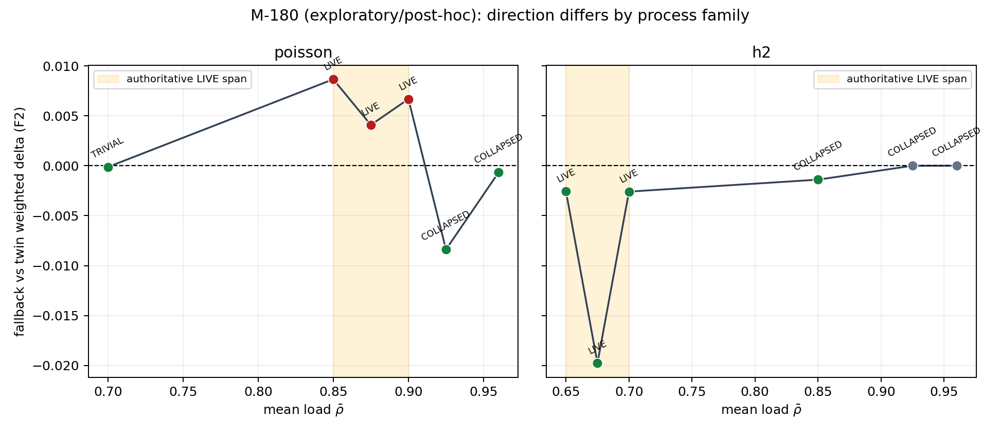

# LESSON 23.21 a--j -- SLA NGOAI SINH, CUSTODY, VA VUNG SONG | DONG

Ngay dong : 2026-08-24

Pham vi  : 23.21, 23.21b..j, va hau kiem 23.21h-close

Amendment: 23-52 .. 23-63

Artifact headline: `results/LIVE/phase-23/live_region_sweep_slaB.json`

## 1. Phan quyet mot cau

Lesson da loai SLA noi sinh S14, dung truc SLA ngoai sinh S-B, do lai duong
ong tren truc AoI duoc duyet, va tim duoc vung song 12 cell. Ket qua hep cuoi
cung la: A/B dong y 10/12, nhung tac dung fallback khong phai ham cua tai
don thuan -- no doi theo **ho phan phoi**. h2 LIVE co delta co loi 3/3; poisson
LIVE co delta co hai 3/3. Day la M-180 `EXPLORATORY/POST-HOC`, khong phai
mot du doan moi duoc tao sau khi thay so.

## 2. Chin viec lon da dong

| # | Viec | Bang chung cung |
|---:|---|---|
| 1 | Loai S14 | `w_loss == t_delay_ms*100` tai 10/10 cell; `opt_viol_rate == 0.15` tai 8/8 gate cell -- nguong cu noi sinh |
| 2 | Dung SLA ngoai sinh | S-B: 50 ms, 1%, `w_loss=5000`; manifest khong con fixpoint/derived field |
| 3 | Tach tac dong `T_delay` | S-A va S-B cho `max abs(delta S_pivotal)=0.0` vi delay do duoc deu duoi 50 ms |
| 4 | Vung song la mot mien | 33/134 cell kha thi LIVE tren mat phang `(rho,sigma)`, khong phai mot moc rho |
| 5 | Wave 4 | p@.875, p@.900, h2@.650, h2@.675: 4/4 LIVE; 12/12 build qua G1..G4 |
| 6 | Song nui `(rho,T_loss)` | p@.960 COLLAPSED tai 1% nhung `S_pivotal=0.9702` tai 5% |
| 7 | Phan xu L51 | Digest lich su con trong `provenance.inputs`; trang thai tach VERIFIED_ORIGINAL / NOT_ORIGINAL / VERIFIED_SUPERSEDED_GENERATION / UNKNOWN |
| 8 | Custody | backup 23/23 parquet, 0 SHA mismatch; RAW/SUPERSEDED read-only; marker `custody`; mutation no-replace |
| 9 | Vung song S-B | 12 cell, A/B 10/12; M-176..179 PASS; clean replay 0 mismatch; M-180 theo ho |

## 3. Ket qua 23.21h sau hau kiem

### 3.1. Phep kiem da ky

```text
M-176  A/B agreement >= 8/12                     10/12       PASS
M-177  rho_hit in [0.900,0.925]                  0.925       PASS
M-178  err_neo p@.875,p@.900 in [0.20,0.30]      .257/.252   PASS
M-179  spread twin_deg A-live in [1.00,1.50]     1.281290    PASS

M_57   h2 A-live lift-swing < 0                  +.011607    MISS
M_47b  confirm delta <= 0 all A-live heldout     p875,p900>0 MISS
```

M_57 va M_47b van la hai phat bieu da ky rieng nen van ghi hai MISS, nhung
khong dien giai chung nhu hai bang chung doc lap. Ca hai chi vao cung mot mau:
dau fallback doi theo ho.

M_54 `[-,-,-,+]` duoc ha thanh `DIAGNOSTIC`: conditional tren ba am/mot
duong, may rui dat diem duong o cuoi la `1/4`, dung 2 bit. No khong con nam
trong `verdict` cua schema v3.

### 3.2. M-180 theo ho (post-hoc)

| ho / regime | giup | hai | trung tinh |
|---|---:|---:|---:|
| h2 LIVE | 3 | 0 | 0 |
| h2 non-LIVE | 1 | 0 | 2 |
| poisson LIVE | 0 | 3 | 0 |
| poisson non-LIVE | 3 | 0 | 0 |

Tren nhanh poisson tai cao `.850,.875,.900,.925`, dau chuyen tai cell
COLLAPSED dau tien `.925`. Phat bieu do khong bao phu toan truc:
`poisson@.700` TRIVIAL cung co delta am. Hinh paper/descriptive:



### 3.3. NT 51

Muon tai dung mot menh de dau qua doi truc, viet dai luong thanh cong thuc va
dem vi tri tham so truc. Mot gia tri qua phep bien doi don dieu co co hoi giu
dau/thu tu. Hieu/ti so voi tham so xuat hien o hai ve khac nhau thi khong.
`lift-swing` thuoc loai sau, nen phai ky lai thay vi gan nhan "cau truc".

## 4. Hai gate dong artifact

G23-228 clean replay:

```text
run HEAD                 6aa08c865c49000f71b03bebe5c569875b575f25
artifact git_dirty       false
artifact hash == HEAD    true
cells                    3564 leaves, 0 mismatch, bit-exact
metrics                    31 leaves, 0 mismatch, bit-exact
live_definition_table      60 leaves, 0 mismatch, bit-exact
```

G23-229 family-selection positive control:

```text
p@.900 folds             101:F2 102:F2 103:F6 104:F2 105:F6
selected - F2            +0
forced F2b/P3 - F2       +0.012923831842096334
```

Vay selection da chay vao risk; viec F6 trung F2 la suy bien so hoc tren mau,
khong phai silent no-op. Muc hep nay khong chung minh F6 va F2 tuong duong
noi chung.

## 5. Threats to Validity khong duoc lam tron

### 5.1. NC_H stress

Eligibility tren builder `sigma=0.0096` PASS 4/4. Stress tai `sigma_rho` cua
SLA-regime FAIL 4/4: h2@.650 `3.25x`, h2@.675 `7.7x`, p@.875 `51.8x`,
p@.900 `63.3x` nguong. Hai cell poisson lam M_47b MISS la hai cell stress
nang nhat. Delta da do hop le cho distribution builder; chua duoc ngoai suy
sang distribution van hanh neu chua co sensitivity tien dang ky.

### 5.2. Ten delta

`delta_system_vs_neo` dung ve dai so nhung mo ho khi doc artifact. L88 giu
khoa tuong thich va them ten ro:

```text
delta_fallback_vs_twin_weighted
  = reject_share * (err_F_given_reject - c_star_err_twin_given_reject)
```

### 5.3. Threats ton tai tu truoc

```text
- L35: phan du hinh dang AoI 4.10 sigma, co che chua biet
- L32: d qua probe +/-6.5 ms
- L51b: 5/9 input Phase 22 khong tai tao duoc nguyen trang
- L87: backup logic chua doc lap thiet bi
- G23-200: p90 lech 5.72e-06; gia thiet float32 bi bac bo
- G23-202: equal==True khong kha chuyen; G23-219 thay bang nhom A/B
```

## 6. Bay lan tu bac bo

1. M-138: co che "mang sup" do chinh lesson dat ra bi nguoc dau.
2. Cau "opt_viol <1% la bai toan qua de" bi rut (L61).
3. Cau `S_pivotal(T*)` cao suy ra nguong noi sinh o dinh bi rut vi vong tron.
4. Gia thiet float32 cua L71 bi do bac bo va patch duoc hoan nguyen.
5. Tien de "digest lich su da mat" bi lat lai bang `provenance.inputs`.
6. Cach chay M-136 tren cung parquet bi bac bo: `w_loss` la tham so sinh (L77).
7. M_57 va M_47b MISS nguyen, khong noi nguong.

## 7. Mon no mang sang dung chu

23.22 so huu:

```text
- L81 / G23-209 FAIL: tach artifact spans_axis khoi PENDING
- family degeneracy: 16 bin danh nghia, chi 4.8..8 bin reject khong rong;
  action map gan hang so, F6 trung F2 tai 12/12 cell
```

Ba gate van `NOT_RUN`, khong duoc lam tron thanh PASS:

```text
G23-217   sensitivity M-136 can build lai parquet tai tung w_loss (L77)
G23-212   tai tao artifact lich su bat kha thi theo L51b; G23-212a/b chi
          chung minh tuong duong duong code tren tap input con ghim
G23-220   gate da mo cua 23.21j, chua co bang chung de cham
```

Threat vinh vien/ngoai lesson: L32, L35, L51b, L87 va NC_H stress o muc 5.

## 8. Gate ledger sau khi dong

Dem doc lap cac dong co lesson bat dau bang `23.21` sau G23-228/229:

```text
78 gate = 71 PASS + 3 FAIL + 3 NOT_RUN + 1 ADJUDICATED
```

FAIL va ADJUDICATED la ket qua da bao cao, khong phai loi chua sua:

```text
FAIL          G23-200, G23-202, G23-209
ADJUDICATED   G23-204
NOT_RUN       G23-217, G23-212, G23-220
```

## 9. File co the chay va file ket qua

Chay lai headline tu worktree tracked sach:

```bash
.venv/bin/python -m cert.live_region_sweep --run
```

Chay hai doi chung va ve hinh:

```bash
.venv/bin/python -m tools.g23_228_clean_replay
.venv/bin/python -m tools.g23_229_family_selection_control
.venv/bin/python -m tools.fig3_live_region_by_family
```

Ket qua authoritative va output truc quan:

```text
results/LIVE/phase-23/live_region_sweep_slaB.json
results/LIVE/phase-23/fig3_live_region_by_family.png
results/RAW/phase-23/g23_228_clean_replay.json
results/RAW/phase-23/g23_229_family_selection_control.json
```

Doc chi tiet: `41-live-region-exogenous.md`. File nay dong toan Lesson 23.21;
khong mo thiet ke hay chay sensitivity cua 23.22 sau khi da xem dau.

## 10. Kiem thu cuoi

```text
full suite : 1452 passed, 44 skipped, 11 deselected in 509.60s
custody    : 3 passed, 1504 deselected in 14.17s
closure    : 41 passed, 1 skipped in 26.81s
```
