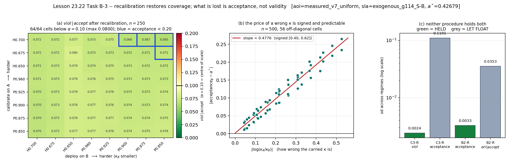

# LESSON 23.22 A0--B-3 -- TAXONOMY, TRANSFER, VA TAI HIEU CHUAN | DONG

Ngay dong : 2026-08-26

Pham vi  : 23.22 Task A0/A/B/B-2/B-3

Amendment: 23-64 .. 23-68 (gom cac amendment bo sung 65b--d, 66b, 67b)

Tag dong : `lesson-23-22-complete`

## 1. Phan quyet mot cau

C3 khong mua duoc mot quyet dinh tot hon B2 tai acceptance khop. No mua duoc
mot PHAT BIEU bao phu, mot thu tuc tai hieu chuan de lay lai phat bieu do o
che do moi, va mot co chan doan khi co mau khong du. Gia phai tra la yeu cau
co mau lon hon va acceptance troi khi mang `kappa` sai.

## 2. Bang day du M-181 .. M-206

Bang nay giu nguyen dai va phan quyet da ky. `HIT/MISS` danh gia menh de;
`PASS/FAIL` la trang thai gate. Mot gate FAIL khong tu dong la loi phan mem.

| Ma | Gate | Do duoc | Phan quyet |
|---|---|---|---|
| `M-181` | G23-231 | block/o 436.4 / 457.6 / 457.5 trong dai [440,500]: 2/3 | **MISS**; gate FAIL vi doi 3/3 |
| `M-182` | G23-231 | ti so block 1.1458 / 1.0926 / 1.0929 trong [1.00,1.15]: 3/3 | **HIT**; 4x hang chi mua 1.09--1.15x block |
| `M-183` | -- | spread_z 1.4919 / 1.5979 / 1.5978 | **DA XEM**, khong cham diem |
| `M-184` | G23-232 | spread_m: 1.2007 / 1.0286 / 1.1149, dat 2/3 | **HIT** theo nguong >=2/3 |
| `M-185` | G23-232 | ti so qhat m3: 1.1460 / 1.0157 / 1.1029, dat 2/3 | **HIT** theo nguong >=2/3 |
| `M-186` | G23-233 | 1.0015 / 1.0124 / 1.0639 trong dai [0.50,1.00]: 0/3 | **MISS**; phep gop tron ba hieu ung (`L90`) |
| `M-187` | G23-234 | V-N vo va V-S giu: 2/3 MAIN; 4/12 toan bo | **MISS**; H-A dang manh bi bac bo |
| `M-188` | G23-239 | 0.5375 / 0.5315 / 0.5406 trong [0.45,1.00] | **HIT 3/3**; nhanh HANG chi phoi |
| `M-189` | G23-244 | `V-N - V-S > 0` tren 8/8 cell A=True | POST-HOC regression control, khong diem |
| `M-190` | G23-252 | drift C3 poisson->h2 0.2352 > h2->poisson 0.1803 | **HIT**, nhung bi ghep voi chieu rho (`L92`) |
| `M-191` | G23-245 | 4 cell `qhat_at_sample_max=true` tai kappa=1, dai [1,8] | **HIT** |
| `M-192` | G23-246 | giam don dieu 8/8; nguong lien tuc p@.925 = 0.5 | **HIT** theo cach doc doan lien tuc; xem `L94` |
| `M-193` | G23-248 | C3 trung bit 8/8; B2 lech max 0.02061 > 0.02 | **MISS/FAIL**; wiring that van sach |
| `M-194` | G23-249 | drift B2/C3 = 0.2174/0.2090 = 1.04x < 3x | **MISS**; du doan chinh Task B bi bac bo |
| `M-195` | G23-250 | 6/30 o trong dai hai phia, nguong 20/30 | **MISS**; dai phat ca chieu bao thu |
| `M-196` | G23-251 | trung vi `abs(err_C3-err_B2)` = 0.00526 <= 0.02 | **HIT** |
| `M-197` | G23-257 | Spearman +0.9500/+0.8915; viol 0.5866 > 0.0200 theo dau | **HIT MU** tren cell chet |
| `M-198` | G23-258 | rho(m_hat,scale)=+0.9650; dau dung 53/56 | **HIT**; ve dau khong mu |
| `M-199` | G23-259 | duoi 29 block: C3 gan co 100%; B2 huu han 100%, gan co 0% | **HIT** |
| `M-200` | G23-261 | delta acceptance/viol = 0.000e+00 tren 8/8 | **HIT**, kiem wiring khong mang thong tin the gioi |
| `M-201` | G23-262 | sd viol 0.00242; sd acc 0.11007; mean viol 0.07413 | **HIT**; ve sd viol ha cap (`L103`) |
| `M-202` | G23-263 | Spearman +0.9674; slope 0.4776 | **HIT**; gia cua kappa sai co dau va du doan duoc |
| `M-203` | G23-264 | HOP 60/64; tach ve: coverage 64/64, acceptance 60/64, max viol 0.0800 | **HIT**; acceptance bind (`L104`) |
| `M-204` | G23-265 | n*(C3-R)=120; n*(B2-R)=30; ti so 4.00 | **HIT**; 30 la san luoi |
| `M-205` | G23-266 | trung vi `abs(derr)` = 0.00549 | **HIT**; trung vi gop che xu the (`L102`) |
| `M-206` | G23-267 | sd err B2-R=0.03531; C3-R=0.01500 | **HIT**; ve doi xung cua menh de bao toan |

## 3. Anh xa ma cu G23-108 .. G23-113

Ban ke hoach ngoai repo dung sau ma 108--113 da va cham voi gate that cua
Lesson 23.19E. Chung KHONG phai alias co the dung trong ledger. Anh xa lich su
sang dai canonical da cap la:

| Ma cu ngoai repo | Dai gate canonical | Khoi cong viec |
|---|---|---|
| G23-108 | G23-230..238 | Task A0/A: do lai taxonomy tren truc v7 |
| G23-109 | G23-239..244 | sua `L91`, tach phep do CI, regression controls |
| G23-110 | G23-245..247 | san on dinh, nguong lien tuc, `qhat_source` |
| G23-111 | G23-248..256 | Task B: ma tran chuyen giao va doi chung |
| G23-112 | G23-257..260 | cham mu cell chet va chi phi tai hieu chuan |
| G23-113 | G23-261..269 | Task B-3: tai hieu chuan qua che do |

Chi `G23-230..269` duoc dung trong code, artifact va `GATES.md`. Cac dong
`G23-108..113` hien co trong ledger van giu nghia Lesson 23.19E cua chung.

## 4. Gate ledger sau khi dong

Dem doc lap cac dong co lesson `23.22` trong `GATES.md`:

```text
40 gate = 32 PASS + 7 FAIL + 1 DIAGNOSTIC
```

Bay FAIL da duoc dien giai va khong phai viec chua chay:

```text
G23-231  M-181 chi 2/3
G23-233  M-186 = 0/3
G23-234  M-187 = 2/3
G23-248  M-193: dai B2 truot 0.00061, wiring C3 trung bit
G23-249  M-194: C3 dong bang troi ngang B2
G23-250  M-195: tieu chi hai phia phat chieu bao thu
G23-254  NC-2 FIRE: score ngau nhien thang thang drift
```

`G23-260` la DIAGNOSTIC post-hoc, khong dem diem. Cac gate con lai PASS.

## 5. Ket qua chinh cua bon task

1. Task A0/A: bo truc `m_hat` tang dung 4x hang moi o nhung chi tang
   1.09--1.15x block; M-188 tach duoc hieu ung hang va cho ~1.9x do on dinh.
2. Task B: mang nguyen `qhat_A` sang B khong ben hon B2. Ca hai deu troi;
   that bai cua C3 co dau theo ti le thang nhung Task B da dung thang drift
   khong du suc phan biet.
3. Task B-2: C3 biet khi co mau khong du, B2 khong co co; de dat diem van
   hanh C3 can 120 block theo tieu chi co san, B2 can 20 trong phep do B-2.
4. Task B-3: khi co nhan tu B va tai hieu chuan, coverage duoc khoi phuc tren
   64/64 o. `kappa_A` sai lam mat acceptance o 4/64 o, khong lam mat validity.
   Menh de bao toan do duoc: C3-R giu viol, B2-R giu acceptance.



## 6. Threats va no mang sang

```text
L92    ho tai bi ghep hoan toan voi rho trong tap 8 cell song; khong duoc
       phat bieu "qua HO TAI".
L100   `qhat_source` moi nhin thay nhanh none doi ten.
L101   doi chung cell chet dung nguong tuyet doi khong the fail.
L102   trung vi gop cua M-205 che xu the theo acceptance.
L103   dai sd(viol) cua M-201 rong qua muc sau PILOT.
L104   tieu chi HOP phai bao cao tung ve.
L104b  bang qhat_source tung bo sot `degenerate_partial`.
L105   `rows_dead` 656 dong da tieu tap mu cell chet.
```

Lesson 23.22c chi duoc mo bang mot amendment moi, sau tag dong nay. No phai
pilot do kho truoc, ky nguong tuong duong cho null "ho tai khong them suc giai
thich", va coi tap mu la tai nguyen can kiet.

## 7. File chay va file ket qua

```text
code      cert/config_matrix.py
          cert/transfer_matrix.py
          cert/recalibration_cost.py
          cert/recalibrate_transfer.py
          tools/fig4_recalibrate_transfer.py

artifact  results/LIVE/phase-23/taxonomy_audit.json
          results/LIVE/phase-23/transfer_matrix.json
          results/LIVE/phase-23/recalibration_cost.json
          results/LIVE/phase-23/recalibrate_transfer.json

figure    results/LIVE/phase-23/fig4_recalibrate_transfer.png

detail    docs/phase-23/43-taxonomy-audit.md
          docs/phase-23/44-transfer-matrix.md
          docs/phase-23/45-recalibration-cost.md
          docs/phase-23/46-recalibrate-transfer.md
```

Tai tao hinh va test khoa vao gate:

```bash
.venv/bin/python -m tools.fig4_recalibrate_transfer
.venv/bin/python -m pytest test/test_fig4_recalibrate_transfer.py -q
```

## 8. Kiem thu cuoi

```text
full suite   : 1515 passed, 44 skipped, 12 deselected in 510.07s
collect HEAD : 1554/1566 tests collected, 12 deselected in 14.82s
collect moi  : 1559/1571 tests collected, 12 deselected in 12.99s
diff         : +5 collected, 0 mat
```

Nam node moi gom bon test truc tiep trong `test_fig4_recalibrate_transfer.py`
va mot parametrization tu dong cua test kiem day du CLI cho module tool moi.

## 9. Bo sung 2026-08-26 -- no da tra sau khi dong

Muc nay THEM VAO sau khi doc duoc dong. Noi dung muc 1--8 KHONG bi sua: chung
la ghi chep tai thoi diem dong. Day la con tro tien.

### 9.1. `L92` da duoc go MOT PHAN

Muc 6 ghi "khong duoc phat bieu 'qua HO TAI'". Sau `A070b` (`G23-285..288`):

```text
GO DUOC     o muc MUC TAI -- `M-222` HIT: tai `rho` in {0.744, 0.750} ca hai
            ho cung song, va 3/4 cap chuyen giao giua ho dung duoc.
            -> `CL-08` duoc phep phat bieu, kem bon rang buoc.

KHONG GO    o muc TRUC DOC LAP -- `NC-W-1` FIRE, `M-223`(b) khong the fail.
            -> `CL-11` CAM phat bieu "ho tai khong them suc giai thich".

KHONG GO    o muc DON BAY -- `L120`: trong OVERLAP-4, cap CUNG HO lai la cap
            co `|log(kappa_A/kappa_B)|` lon nhat.
```

### 9.2. Tag dong

Muc dau ghi "Tag dong : `lesson-23-22-complete`". Tag do KHONG TON TAI cho
den 2026-08-26, khi no duoc gan HOI TO vao `18f82cd` bang
`scripts/apply_closure_tags.sh`. Xem `L114`. Tag DONG gan hoi to la vo hai
(commit bat bien), nhung phai duoc khai bao -- va no duoc khai ngay trong
message cua chinh tag.

`L114d`: remote `origin` mang **0 tag**. Tag chi song tren mot may.

### 9.3. Lenh o muc 7 KHONG chay duoc

Muc 7 in `.venv/bin/python`. Duong dan do khong ton tai; xem `L117`. Trinh
thong dich that:

```bash
/home/ubuntu/miniforge3/envs/sdn_rl/bin/python -m tools.fig4_recalibrate_transfer
/home/ubuntu/miniforge3/envs/sdn_rl/bin/python -m pytest test/test_fig4_recalibrate_transfer.py -q
```

### 9.4. Con tro tien

```text
docs/phase-23/49-close-23-22d.md   nhanh W, E, OVERLAP -- G23-277..288
docs/phase-23/CLAIMS.md            11 phat bieu paper duoc phep dua ra
docs/phase-23/BACKLOG.md           hang doi `L*` chua xu ly (`A071` R2)
docs/phase-23/A071-amendment-71.md QUY TAC 23-STOP
results/DATA_MANIFEST.json         so tong hash 122 file du lieu
```
