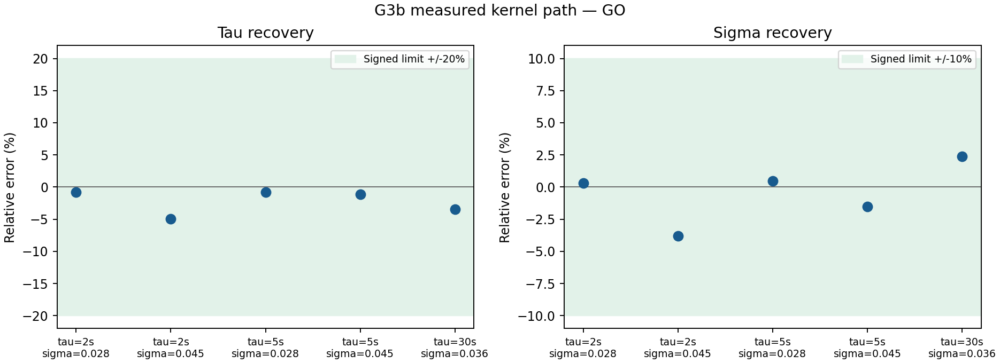

# G′.3b — Kết quả đo σ/τ và kiểm tra trực giao

**Phán quyết: `GO`.** Dữ liệu đo trên 8 link veth/HTB của kernel, trên host hiện tại.
Bắt đầu: 2026-09-06T03:51:09.883762+00:00; hoàn tất: 2026-09-06T07:09:25.180901+00:00.
Đã thực hiện 9 lượt, 5/5 ô; tổng thời lượng đo danh định 11890 s.
Prereg: [doc 65](65-prereg-g3b-sigma-tau-roundtrip.md), tag `phase-G2-g3b-prereg`, commit `026533a72e4386992b9eb4494f774dca3a3d1de2`.
Ngưỡng và cách tổng hợp được giữ nguyên sau khi ký. Host không quiesce.

## 1. Bảng đánh giá gate

| Gate | Số đo | Ngưỡng đã ký | Kết quả |
|---|---:|---|---|
| RT-C1 | 0.03818517 | <= 0.10 | PASS |
| RT-B1_small_tau | 0.049411307 | <= 0.20 | PASS |
| RT-B1_tau30 | 0.034264344 | <= 0.20 | PASS |
| RT-O1 | 0.048186858 | <= 0.10 | PASS |
| RT-O2 | 0.01372423 | <= 0.05 | PASS |
| T-5 | 0.4 | >= 0.30 | PASS |
| Q-1 | 4.7562908 | >= 4.36 | PASS |
| C-1 | 0.0055792683 | <= 0.01 | PASS |
| B-1a | 0.90823908 | >= 0.8264 | PASS |
| S-1 | 4.7790967e-05 | <= 0.02 | PASS |
| K-2 | 0 | <= 0.001 | PASS |

Lưới đầy đủ: True; tất cả ước lượng hữu hạn: True.

## 2. Bảng round-trip

σ̂/σ được chia theo σ thiết kế của từng link trước khi lấy trung vị gộp qua link/lượt.

| τ đặt (s) | σ_ref | Lượt | Lags fit | τ̂ (s) | Sai số τ | σ̂/σ | Sai số σ |
|---:|---:|---:|---|---:|---:|---:|---:|
| 2 | 0.028 | 2 | 2–8 | 1.984606 | -0.770% | 1.003095 | +0.310% |
| 2 | 0.045 | 2 | 2–8 | 1.901177 | -4.941% | 0.961815 | -3.819% |
| 5 | 0.028 | 2 | 2–20 | 4.958147 | -0.837% | 1.004533 | +0.453% |
| 5 | 0.045 | 2 | 2–20 | 4.944392 | -1.112% | 0.984901 | -1.510% |
| 30 | 0.036 | 1 | 2–120 | 28.972070 | -3.426% | 1.023714 | +2.371% |



## 3. Trực giao

```json
{
  "available": true,
  "d_log_tau_hat_d_log_sigma": -0.04818685784459802,
  "d_log_sigma_ratio_d_log_tau": 0.013724229722009824
}
```

Thống kê đã ký lấy trung bình có dấu của hai độ dốc rồi mới lấy trị tuyệt đối.
Không diễn giải PASS của trung bình thành giới hạn cho từng độ dốc riêng hoặc từng link.

## 4. Dụng cụ hỗ trợ và đối chiếu chuỗi thô

Controller delta_rms lớn nhất: 0.105881 ms.
Clipping, signal fraction, sink và underrun nằm trong bảng gate ở trên.
Đã tính lại estimator từ NPZ và đối chiếu mọi ước lượng từng link/lượt với JSON (rtol=1e-12).
Đã đối chiếu từng mảng checkpoint với NPZ tổng hợp bằng so sánh bằng nhau chính xác.
Kết quả gate tính lại trùng khớp. Không chạy lại mạng cho bước đối chiếu này.

| τ | σ_ref | τ̂ từ target | σ̂/σ từ target | Var(measured−target) trung vị | ACF residual lag 1 trung vị |
|---:|---:|---:|---:|---:|---:|
| 2 | 0.028 | 1.978064 | 1.002607 | 6.0982e-05 | -0.491705 |
| 2 | 0.045 | 1.901215 | 0.961647 | 6.20301e-05 | -0.498621 |
| 5 | 0.028 | 4.964510 | 1.004364 | 6.11373e-05 | -0.501379 |
| 5 | 0.045 | 4.942963 | 0.984937 | 6.17935e-05 | -0.497964 |
| 30 | 0.036 | 28.972944 | 1.023753 | 6.18313e-05 | -0.496830 |

Các số từ target chỉ dùng chẩn đoán biến động mẫu hữu hạn và đường đo; không thay thế σ/τ danh định trong gate.

Hạ tầng:

```json
{
  "n_samples": 11935,
  "span_s": 11934.936249,
  "cpu_percent_median": 3.212,
  "cpu_percent_p95": 5.713,
  "load_1m_max": 2.625,
  "clock_skew_abs_max_ms": 0.419131,
  "steal_recorded": false,
  "drop_in_increase": 0,
  "drop_out_increase": 0,
  "err_in_increase": 0,
  "err_out_increase": 0
}
```

## 5. Điều đã thiết lập

Code estimator hỗ trợ lag_lo=2 và giữ kết quả số cũ với mặc định lag_lo=1 (200 chuỗi hồi quy).
Bảy kiểm thử chuẩn bị PASS; mô phỏng khả thi và dry-run PASS trước khi đo mạng.
Các số và kết quả gate ở mục 1–3 là bằng chứng đo được cho đúng host, cấu hình và các ô đã thực hiện.
Chuỗi đo, chuỗi target, từng replicate và log hạ tầng được giữ lại để kiểm toán.

## 6. Điều chưa thiết lập và giới hạn

- Đây là đường kernel veth/HTB; không phải phép thử NIC vật lý, Internet hoặc nhiều host.
- Trung vị gộp 16 hoặc 8 ước lượng link/lượt của G3b khác protocol trung vị 3 lượt sau hiệu chỉnh b(tau) ở doc 55.
- Không chứng nhận các điểm τ/σ chưa đo, toàn miền khả thi, hoặc trực giao ở τ=30 chỉ có một mức σ.
- Tám quá trình target độc lập không tự chứng minh tám quan sát độc lập qua kernel dùng chung.
- Log hạ tầng hiện có không ghi CPU steal riêng; không suy ra số steal từ CPU/load.
- Mô phỏng và dry-run là SYNTHETIC_NO_NETWORK; các gate sink/clip/underrun ở dry-run là giá trị giả lập.
- Các sửa lỗi code mẫu trước khi đo (phương sai nhiễu, guard dt, Q-1, lưu checkpoint) được ghi ở prereg mục 7.

## 7. Artifact và SHA256

Số liệu ô: `g3b_roundtrip.csv`; từng link/lượt: `g3b_per_link.csv`; toàn bộ kết quả: `g3b_sigma_tau.json`.
Chuỗi thô: `g3b_sigma_tau_series.npz`; dữ liệu mỗi lượt: `g3b_sigma_tau_checkpoints/`.
Các đường dẫn dưới đây tính từ thư mục gốc repository.

| Artifact | SHA256 |
|---|---|
| [results/SMOKE/phase-G2/g3b_sigma_tau.json](../../results/SMOKE/phase-G2/g3b_sigma_tau.json) | `e71d61c1bdef6c3b58c6c2b3d640847e5797e8e446169cb53f40ddf1318baf08` |
| [results/SMOKE/phase-G2/g3b_sigma_tau_series.npz](../../results/SMOKE/phase-G2/g3b_sigma_tau_series.npz) | `cfb519b7b46bdc95e186d4c96c0149a1127929ad8fe112c123b2b5cccb8eec13` |
| [results/SMOKE/phase-G2/g3b_bias_sim.json](../../results/SMOKE/phase-G2/g3b_bias_sim.json) | `7703078a2d72eea35198b563852201a6760d8257bd0233b1dbbc3112c37e472c` |
| [results/SMOKE/phase-G2/g3b_dry_run.json](../../results/SMOKE/phase-G2/g3b_dry_run.json) | `a676ec3f63e01af7a72501096ad8b2eeafc528aa97d594b56d25b86332991c48` |
| [results/SMOKE/phase-G2/g3b_signed_dry/g3b_dry_run.json](../../results/SMOKE/phase-G2/g3b_signed_dry/g3b_dry_run.json) | `67d27214dfff63eb8a3dfdbf4d5c37cfd3c92e476013afe4b042aeebaca89329` |
| [results/SMOKE/phase-G2/g3b_infra.jsonl](../../results/SMOKE/phase-G2/g3b_infra.jsonl) | `3584a5733b8b8cef98ab5ea4aa9b97f3f77c71ca0c0a4ac94555a86dcaa107de` |
| [results/SMOKE/phase-G2/g3b_roundtrip.csv](../../results/SMOKE/phase-G2/g3b_roundtrip.csv) | `a9de8eb0adf0826f58fa1a9011839936ca820b1ecdf6d525e97ffadc6d6fcf10` |
| [results/SMOKE/phase-G2/g3b_per_link.csv](../../results/SMOKE/phase-G2/g3b_per_link.csv) | `2e308a52635fcc6809cbd85668bd183b8d5f63e00ca9c6a564074d80ccb03319` |
| [results/SMOKE/phase-G2/g3b_saved_series_audit.json](../../results/SMOKE/phase-G2/g3b_saved_series_audit.json) | `5249e97daf1e0bf6f2693bedf322d5b2587cf19e44e68c011e4e2eba9486e566` |
| [results/SMOKE/phase-G2/g3b_roundtrip.png](../../results/SMOKE/phase-G2/g3b_roundtrip.png) | `c5c69b5cdc6f162b895833ae6ed17875a86ab0659a6ccd5923793096520ed5f0` |
| [results/SMOKE/phase-G2/g3b_logs/bias_sim.log](../../results/SMOKE/phase-G2/g3b_logs/bias_sim.log) | `bdaa38fcbe301bcdb026d08f8d7b025b41b61f5a6d166a6e4852e02161240f4e` |
| [results/SMOKE/phase-G2/g3b_logs/dry_run.log](../../results/SMOKE/phase-G2/g3b_logs/dry_run.log) | `6868cd1464bb24c938f1ec27c7ac56e29df1262ffb5747d85770a16767e32822` |
| [results/SMOKE/phase-G2/g3b_logs/estimator_tests.log](../../results/SMOKE/phase-G2/g3b_logs/estimator_tests.log) | `5406a2081f7cdd314f344cc21820a5af9b1bb38c4c75d54acca13b6c473e61a3` |
| [results/SMOKE/phase-G2/g3b_logs/infra_monitor.log](../../results/SMOKE/phase-G2/g3b_logs/infra_monitor.log) | `e3b0c44298fc1c149afbf4c8996fb92427ae41e4649b934ca495991b7852b855` |
| [results/SMOKE/phase-G2/g3b_logs/network_exit_code.txt](../../results/SMOKE/phase-G2/g3b_logs/network_exit_code.txt) | `9a271f2a916b0b6ee6cecb2426f0b3206ef074578be55d9bc94f6f3fe3ab86aa` |
| [results/SMOKE/phase-G2/g3b_logs/network_run.log](../../results/SMOKE/phase-G2/g3b_logs/network_run.log) | `dff8c943fef7af12c35158c5de5e59bae10b9aaac6f7ed5cb8bd456e6f9668eb` |
| [results/SMOKE/phase-G2/g3b_logs/preflight_tests.log](../../results/SMOKE/phase-G2/g3b_logs/preflight_tests.log) | `9f1b33772c10f43dd85b1190afbba97a7f321e6d60334a87ea80b26252725e2f` |
| [results/SMOKE/phase-G2/g3b_logs/setup.log](../../results/SMOKE/phase-G2/g3b_logs/setup.log) | `d9fde16e90ab3221afe26fc33520eeec3f9537439738818bd2615a1db0184031` |
| [results/SMOKE/phase-G2/g3b_logs/signed_dry_run.log](../../results/SMOKE/phase-G2/g3b_logs/signed_dry_run.log) | `6868cd1464bb24c938f1ec27c7ac56e29df1262ffb5747d85770a16767e32822` |
| [results/SMOKE/phase-G2/g3b_logs/teardown.log](../../results/SMOKE/phase-G2/g3b_logs/teardown.log) | `6a35ab6118723ca238ed97af8d0db5eb65be22ae027c9caf23a25a2cbb3fe90e` |
| [results/SMOKE/phase-G2/g3b_sigma_tau_checkpoints/t2_s0.028_rep0.json](../../results/SMOKE/phase-G2/g3b_sigma_tau_checkpoints/t2_s0.028_rep0.json) | `726f19adfee8148cf23661dd77c266675ea8564116cc588c8c87e6ab7f2505d1` |
| [results/SMOKE/phase-G2/g3b_sigma_tau_checkpoints/t2_s0.028_rep0.npz](../../results/SMOKE/phase-G2/g3b_sigma_tau_checkpoints/t2_s0.028_rep0.npz) | `aa82b39887ef111faea3783ba1137e1c9a78d038b1b77b7ea5d116ab82a9d91b` |
| [results/SMOKE/phase-G2/g3b_sigma_tau_checkpoints/t2_s0.028_rep1.json](../../results/SMOKE/phase-G2/g3b_sigma_tau_checkpoints/t2_s0.028_rep1.json) | `1ed9ada0db2d4520869ac39a9dbe7ae06d46e52b55ba4624d5d0daeb8ba12986` |
| [results/SMOKE/phase-G2/g3b_sigma_tau_checkpoints/t2_s0.028_rep1.npz](../../results/SMOKE/phase-G2/g3b_sigma_tau_checkpoints/t2_s0.028_rep1.npz) | `df65196cf8a929fd556a77cf288257fb0ebf086bfabe79f8e2c22d18e5679371` |
| [results/SMOKE/phase-G2/g3b_sigma_tau_checkpoints/t2_s0.045_rep0.json](../../results/SMOKE/phase-G2/g3b_sigma_tau_checkpoints/t2_s0.045_rep0.json) | `489d46136efcd0a3f17c2b35f521052a6573222bb44ddaeb51d27ebe5b617fdf` |
| [results/SMOKE/phase-G2/g3b_sigma_tau_checkpoints/t2_s0.045_rep0.npz](../../results/SMOKE/phase-G2/g3b_sigma_tau_checkpoints/t2_s0.045_rep0.npz) | `34e5d995482cddc5c978edb5d6854a45e53a66a14966761bd9dad6d99c35ed02` |
| [results/SMOKE/phase-G2/g3b_sigma_tau_checkpoints/t2_s0.045_rep1.json](../../results/SMOKE/phase-G2/g3b_sigma_tau_checkpoints/t2_s0.045_rep1.json) | `2581f69fa0e1df68038a27d255a9f80ef8814617b9a4395b440b2225de059f45` |
| [results/SMOKE/phase-G2/g3b_sigma_tau_checkpoints/t2_s0.045_rep1.npz](../../results/SMOKE/phase-G2/g3b_sigma_tau_checkpoints/t2_s0.045_rep1.npz) | `911ff1f63c1626c94568ff6a4778bf55f78f6ab362b8715ca455e7b43ab25e9f` |
| [results/SMOKE/phase-G2/g3b_sigma_tau_checkpoints/t30_s0.036_rep0.json](../../results/SMOKE/phase-G2/g3b_sigma_tau_checkpoints/t30_s0.036_rep0.json) | `e8a497934b02b27bfa97b6252a17ee2d063ae1064e8ed2fe864eed28a97deb92` |
| [results/SMOKE/phase-G2/g3b_sigma_tau_checkpoints/t30_s0.036_rep0.npz](../../results/SMOKE/phase-G2/g3b_sigma_tau_checkpoints/t30_s0.036_rep0.npz) | `551c4df22f80190413cab48ea11200e8c4c4d1512c9be3067e78455ed7068cb9` |
| [results/SMOKE/phase-G2/g3b_sigma_tau_checkpoints/t5_s0.028_rep0.json](../../results/SMOKE/phase-G2/g3b_sigma_tau_checkpoints/t5_s0.028_rep0.json) | `f1f9a6982e872d05c061a961fe996baab9d0fe470c804c1cd40f102ef69ed9a1` |
| [results/SMOKE/phase-G2/g3b_sigma_tau_checkpoints/t5_s0.028_rep0.npz](../../results/SMOKE/phase-G2/g3b_sigma_tau_checkpoints/t5_s0.028_rep0.npz) | `da465b9b7f854314d4303da0d6d6827b50f3e192d5e059e5f1f274da482e2128` |
| [results/SMOKE/phase-G2/g3b_sigma_tau_checkpoints/t5_s0.028_rep1.json](../../results/SMOKE/phase-G2/g3b_sigma_tau_checkpoints/t5_s0.028_rep1.json) | `8999fbca0905affacb02391da2aff0138616fc3b6cd2d044fc9b17851cb60d64` |
| [results/SMOKE/phase-G2/g3b_sigma_tau_checkpoints/t5_s0.028_rep1.npz](../../results/SMOKE/phase-G2/g3b_sigma_tau_checkpoints/t5_s0.028_rep1.npz) | `9b946c72c9c96d973c02ee7e81fb8460587605415aafe1f1c82e90676dfccabf` |
| [results/SMOKE/phase-G2/g3b_sigma_tau_checkpoints/t5_s0.045_rep0.json](../../results/SMOKE/phase-G2/g3b_sigma_tau_checkpoints/t5_s0.045_rep0.json) | `ba63095e5e16bbe36eef47c2228add72f5577c5664e8734321fb703b1fb87657` |
| [results/SMOKE/phase-G2/g3b_sigma_tau_checkpoints/t5_s0.045_rep0.npz](../../results/SMOKE/phase-G2/g3b_sigma_tau_checkpoints/t5_s0.045_rep0.npz) | `59932f41bb9bb103f7388ca44cca64b019f14c37f63a790c8a56062aca67eae1` |
| [results/SMOKE/phase-G2/g3b_sigma_tau_checkpoints/t5_s0.045_rep1.json](../../results/SMOKE/phase-G2/g3b_sigma_tau_checkpoints/t5_s0.045_rep1.json) | `286de1c7f55b8d5f2d6141915b644223b1272b4a3467f47aaa534c6bab88c3f3` |
| [results/SMOKE/phase-G2/g3b_sigma_tau_checkpoints/t5_s0.045_rep1.npz](../../results/SMOKE/phase-G2/g3b_sigma_tau_checkpoints/t5_s0.045_rep1.npz) | `572a8c87d07dd7834edbda26bff70ab435f6cd03315dae7caae0e2d5531a8a44` |
| [tools/g3b_report.py](../../tools/g3b_report.py) | `12c02d3792a7561f6708ee5b04b87f08e690c30bed76f9716bd011fd3be5993c` |
| [tools/g3b_sigma_tau_grid.py](../../tools/g3b_sigma_tau_grid.py) | `2e304f1347d4eedb7801c08fa06468354fccd1981061c1625d85e7e701e33fb3` |
| [tools/g3b_bias_sim.py](../../tools/g3b_bias_sim.py) | `1cb2266bd9ddbae0b793f4376f5f38b1f82d9e827fdd8b2b0de0ba092efe8fb4` |
| [tools/measurement_path_calib.py](../../tools/measurement_path_calib.py) | `dc63f6441cbbeb7ac8574f2e23d70b20e886fc41e00d0bc21fe0f3f7fce0a604` |
| [test/test_estimator_lag_lo.py](../../test/test_estimator_lag_lo.py) | `71ea7cffb12dd8ba9da49528254552672ab072b98b090aab498a6f012f1e5fc9` |
| [test/test_g3b_sigma_tau_grid.py](../../test/test_g3b_sigma_tau_grid.py) | `ba51a16d3c7f5381410517b7be2f452b455d573dba98a175519ff75435c3b004` |
| [docs/phase-G/65-prereg-g3b-sigma-tau-roundtrip.md](../../docs/phase-G/65-prereg-g3b-sigma-tau-roundtrip.md) | `e44c906ef2a0b251bac7dcedda724e91c0467e7260c099e32b947ecdb2a777c6` |
