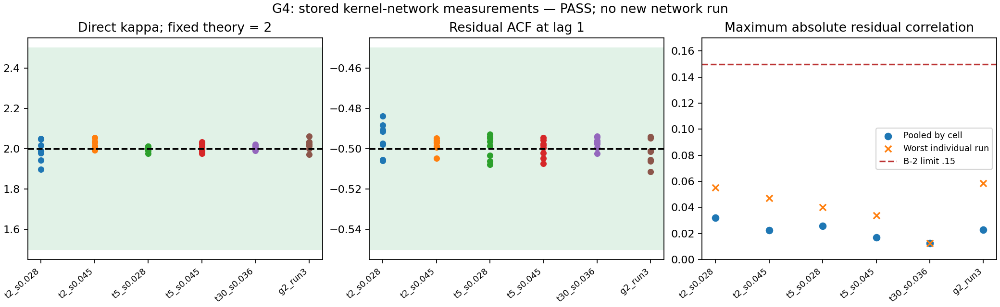

# G′.4 — Chứng nhận đường đo v2

**Phán quyết: GO / certificate PASS trong phạm vi ghi rõ bên dưới.**
Tái phân tích 5 ô G3b (9 lượt, 72 chuỗi link/lượt) và đối chứng G2 run 3 (4 lượt, 32 chuỗi). Không chạy mạng mới.
Prereg phương pháp tái phân tích: [doc 67](67-prereg-g4-nugget-model.md), tag `phase-G2-g4-prereg`. Dữ liệu và nhận xét trước đó đã được biết; đây không phải tiền đăng ký trước khi thu thập.

## 1. Kết quả mô hình

| Ô | κ trực tiếp, trung vị 8 link | ACF1 | max abs(ρ_eps) gộp | max từng lượt | Căn chỉnh |
|---|---:|---:|---:|---:|---|
| t2_s0.028 | 1.988666 | -0.494391 | 0.032004 | 0.055303 | PASS |
| t2_s0.045 | 2.012048 | -0.497790 | 0.022590 | 0.047145 | PASS |
| t5_s0.028 | 2.003997 | -0.497549 | 0.025599 | 0.040105 | PASS |
| t5_s0.045 | 2.007023 | -0.498843 | 0.016769 | 0.033709 | PASS |
| t30_s0.036 | 2.007159 | -0.496830 | 0.012642 | 0.012642 | PASS |
| g2_run3 | 2.021731 | -0.501214 | 0.022681 | 0.058670 | PASS |

G3b: κ trực tiếp=2.004501, IQR=[1.9929499244761408, 2.014869470670364]; gián tiếp qua intercept sf=1.920998. Sai khác trực tiếp so với lý thuyết 2 là +0.225%.
G2: κ=2.021731. Cả 104 chuỗi có cực tiểu Var(measured−target_shifted) tại lag 0. 28 cặp nhiễu được lưu cho từng lượt và từng ô.
sf dự đoán bằng κ=2 so với 40 trung vị link/ô: RMS=0.00681703; max sai lệch=0.02095709.

## 2. Gate và dự đoán

| Gate | Điều kiện | Kết quả |
|---|---|---|
| M-1_aligned | mọi link/lượt aligned ở lag 0 | PASS |
| M-2_finite | mọi thống kê hữu hạn | PASS |
| M-3_rho_eps_within_B2 | max abs(rho_eps) gộp và từng lượt <= .15 | PASS |
| M-4_kappa_in_band | median κ trong [1.5,2.5] ở mỗi bộ G3b/G2 | PASS |
| M-5_acf1_matches_theory | median ACF1 cách −.5 không quá .05 ở mỗi bộ | PASS |
| M-6_sf_rms | sf RMS <= .02 (κ=2 cố định) | PASS |

Dự đoán max nhiễu <=.05 đúng với thống kê gộp, nhưng không đúng với cực đại từng lượt (.05867 ở G2). Gate .15 vẫn PASS. Không đổi ngưỡng. M-6 là ngưỡng sf có trong hướng dẫn và đã được đưa vào prereg trước khi chạy.
ACF1 gần −.5 và κ gần 2 phù hợp mô hình; không chứng minh cơ chế này là nguyên nhân duy nhất hoặc không có phần dư khác.

## 3. Hợp đồng được phát hành

- [measurement_path_cert_v2.json](../../results/LIVE/phase-G2/measurement_path_cert_v2.json)
- SHA256: `6829990d257814e3f26e287cfa861de1121c563f2ac5814bd6d7d35da9f33a0b`
- Sinh từ commit `c0d33ba3852ac53b5834569e837fb9261cbc58ec`, worktree_dirty_at_execution=`False`.
- Hệ số chứng nhận κ=2 là dự đoán cố định, không thay bằng κ fit sau khi xem dữ liệu.
- Công thức: `v(C,dt,L) = (8*L/(C*dt))²/6`, L=1442 byte.
- Self-test đọc 40 giá trị sf thực tế và được thực thi; SHA256 model, nguồn, code và test có trong cert.

## 4. Phạm vi và giới hạn

PASS có điều kiện cho kernel veth/HTB trên host đã đo, dt=.1 s và các dung lượng link có trong NPZ. Giả định remainder đồng đều và độc lập là điều kiện của công thức, không phải hệ quả tất yếu của bảo toàn byte.
Các bảng dt=.05,.15,.2,.25,.5,1,1.5 là dự đoán mô hình chưa được đo xác nhận. Đổi dt/C có thể thay đổi tương quan giữa remainder; max rho_eps đã thấy không phải cận tin cậy tổng thể và không tự chuyển sang cấu hình mới.
Không chứng nhận NIC vật lý/Internet, estimator tau, omega>0, toàn bộ miền điều khiển hay mọi cấu hình telemetry. sf floor là proxy giữ từ protocol; sigma đã hiệu chỉnh cần đánh giá riêng. Bias từng cặp chưa phải bias của estimator omega tổng hợp.
Ví dụ link ad (4 Mbps): sigma_min theo proxy sf=.8264 tại dt=.1 là 0.02568857; dự đoán tại dt=.2 là 0.01284428, giảm đúng một nửa. Đây chỉ là ràng buộc sf; vẫn phải xét Q-1, clipping và các điều kiện khác.
Lưới phân rã telemetry cũ được bỏ trong phạm vi bài này vì dữ liệu residual sẵn có đủ kiểm giả thuyết trực tiếp; không suy ra mọi telemetry đều tương đương.

## 5. Phụ lục G3b và sửa code mẫu

- [Doc 66a — G-L107 và hồi quy](66a-g3b-uncertainty-addendum.md). Doc 66 cũ và gate giữ nguyên.
- Hồi quy beta_sigma=-0.0160297; CI95 OLS=[-0.1575374669349628, 0.1254780155433528]; cận thay đổi thực tế 7.76%. Gom sai số theo link cho cận 14.49%, chỉ xấp xỉ với 8 nhóm.
- Sửa alignment để dịch target so với measured trên cùng độ dài, kiểm đủ link/lượt; code mẫu chỉ cắt chuỗi eps và không kiểm được căn chỉnh.
- Dùng metadata NPZ, allow_pickle=False, kiểm SHA256; lưu cả 28 cặp, ACF1..8, từng replicate và các phía lag.
- Cert từ worktree sạch, không allow-dirty; không ghi đè; không hardcode sf; phân biệt phạm vi đo với ngoại suy.

## 6. Kiểm thử, custody và DOI

Bộ kiểm thử: 7 test G3b/estimator và 5 test G4 (alignment dịch 1 cửa sổ, uniform quantiser, nhiễu chung, đầu vào vô hiệu, dirty certificate, hồi quy và pooling). Log cuối: [g4_tests.log](../../results/SMOKE/phase-G2/g4_tests.log).
Manifest dữ liệu mới: [g4_data_manifest.json](../../results/SMOKE/phase-G2/g4_data_manifest.json), 134 file, 6952580229 byte. Manifest lịch sử DATA_MANIFEST được giữ nguyên; bản mới bổ sung chuỗi G3b/checkpoint.
DOI hiện tại: `None`. Chưa có DOI/bản ghi công bố để xác minh. Inventory và SHA256 đã chuẩn bị; chưa có thao tác tải lên hay công bố. G′.7/G′.8 chưa được coi là vượt yêu cầu DOI.

## 7. Các file để tái sử dụng

- [Bảng tổng hợp CSV](../../results/SMOKE/phase-G2/g4_nugget_summary.csv)
- [Bảng 104 link/lượt CSV](../../results/SMOKE/phase-G2/g4_nugget_per_link_run.csv)
- [JSON mô hình và mọi kiểm tra](../../results/SMOKE/phase-G2/g4_nugget_model.json)
- [JSON hồi quy/bootstrap](../../results/SMOKE/phase-G2/g3b_orthogonality_audit.json)
- [Manifest artifact G4](../../results/SMOKE/phase-G2/g4_artifact_manifest.json)

Lệnh tái lập (dùng tên đầu ra mới vì các artifact từ chối ghi đè): `python -m tools.g4_nugget_model --out NEW.json`; `python -m tools.g3b_orthogonality_audit --model NEW.json --out NEW_AUDIT.json --doc NEW_DOC.md`. Commit dữ liệu/code trước khi `python -m tools.g4_certify --model NEW.json --out NEW_CERT.json`.
