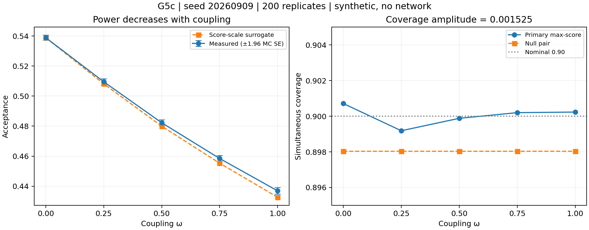

# G′.5c — Kết quả kiểm tra đơn điệu trên seed thứ ba

Ngày: 2026-09-07 UTC. Trạng thái: `SYNTHETIC_NO_NETWORK`.

**Phán quyết: `POWER_AXIS_HOLDS`; phân loại: `REDUCIBLE_TO_EFFECTIVE_SIGMA`. 6/6 gate PASS.**

Tiền đăng ký [doc 74](74-prereg-g5c-monotone.md), tag `phase-G2-g5c-prereg`,
commit `eafe3104bfd0c5d89c1ec55a68dffd9caa0eb0a8`. Test → commit/tag → chạy, đúng thứ tự.
Không sửa doc 72/73, tool G5b, artifact G5b hay nguồn Phase 22 được bảo vệ.
Phần B được quyết định riêng trong [G-A020](76-amendment-G-A020-omega-reduction.md).

## 1. Cấu hình và kết quả thực thi

- Seed `20260909`; 200 replicate × 5 ω × 2 trường hợp (primary/null).
- Mỗi replicate có calibration và test độc lập, mỗi đoạn 600 s mô phỏng,
  dt=0.1 s: 6.000 hàng/đoạn. Tổng 24.000.000 hàng thời gian tổng hợp.
- 4 hành động, 3 khe xếp hạng; tau=3 s; sigma_ref=0.028 tại uA;
  alpha=0.10, kappa_accept=1, kappa_nugget=2.
- Thời gian trong artifact: **19.396898 s**; chỉ một lượt chạy đầy đủ.
- Python: `/home/ubuntu/miniforge3/envs/sdn_rl/bin/python`, NumPy 2.4.3, SciPy 1.17.1.
- `worktree_dirty_at_execution=false`; HEAD khi chạy bằng commit tiền đăng ký.
- `verify_protected()` thành công trước/sau, đối chiếu tag G5 gốc và certificate.
- 44 test G5c/G5b/Phase22 PASS trước commit tiền đăng ký.
- Kiểm cuối: **63 test PASS trong 1.48 s**, gồm G5c, G5b, G6, Phase22 và ledger;
  [log kiểm thử](../../results/SMOKE/phase-G2/g5c_g6_tests.log), SHA256 `9445520b22fd177fed8c024d31266f75145f157dd74a744e4ea6ac8e3aa0bb67`.
- Log: [g5c_monotone.log](../../results/SMOKE/phase-G2/g5c_monotone.log).

Đây là mô phỏng sai số twin. Không gửi gói thật và không chạy Mininet trong lượt này.
Giá trị seed trông giống ngày nhưng chỉ là mã seed, không phải ngày thực thi.

## 2. Bảng gate đã ký

| Gate | Đại lượng | Ngưỡng | Đo được | Kết quả |
|---|---|---|---:|---|
| NC-0 | Vector khác G5b | Phải khác | max abs diff=0.00108917 | PASS |
| P-1 | Biên độ acceptance | >=0.050 | 0.10195333 | PASS |
| P-2 | Biên độ / SD một vệt | >=5 | 7.16199186 | PASS |
| P-3b | max(diff acceptance) | <=+0.005 | -0.02153500 | PASS |
| NC-1 | Biên độ coverage | <=0.005 | 0.00152500 | PASS |
| NC-2 | Biên độ acceptance cặp null | <=0.010 | 0.00000000 | PASS |

`P-3` cũ vẫn VOID. `worst_step` trong summary kế thừa G5b là min(diff),
chỉ được giữ để bảo toàn API; gate mới đọc `monotonicity.worst_increase`.
Các bước: -0.02932750, -0.02729333, -0.02379750, -0.02153500.
NC-0 chỉ kiểm không trùng vector; không tự nó chứng minh độc lập thống kê.

## 3. Số đo theo ω

| ω | Acceptance | MC SE | Coverage | Surrogate acceptance |
|---:|---:|---:|---:|---:|
| 0.00 | 0.53886667 | 0.00086530 | 0.90070917 | — |
| 0.25 | 0.50953917 | 0.00099060 | 0.89918417 | 0.50817250 |
| 0.50 | 0.48224583 | 0.00103089 | 0.89988083 | 0.47995750 |
| 0.75 | 0.45844833 | 0.00103960 | 0.90019833 | 0.45531083 |
| 1.00 | 0.43691333 | 0.00109206 | 0.90023167 | 0.43265667 |

Null acceptance = 0.72595167 ở cả 5 điểm,
null coverage = 0.89803167 ở cả 5 điểm.
CSV có cả hai procedure maxscore/uncorrected và cả hai trường hợp, 20 hàng.



Thanh sai số là ±1.96 MC SE theo 200 replicate (xấp xỉ từng điểm),
không phải khoảng tin cậy đồng thời cho toàn lưới. Điểm surrogate ω=0
trên hình là baseline theo định nghĩa; JSON/CSV để null vì không tính lại.

## 4. Phân rã hiệu ứng — đính chính phép trừ trong doc 73/hướng dẫn

```text
L_total = A(0) − A(1)             = 0.10195333
L_scale = A(0) − A_scale(1)       = 0.10621000
R       = A(1) − A_scale(1)       = 0.00425667
L_total = L_scale − R
```

Surrogate làm giảm acceptance bằng **104.175%** mức giảm thực;
phần dư dương bù lại **4.175%**. Đây là phân rã theo đối chứng
đã ký; R gồm mọi sai khác còn lại, không xác định duy nhất một cơ chế xếp hạng.
Không được nói “95.8% hiệu ứng là scale” như một phép phân rã cộng.

Doc 73 cũng cần đọc theo dấu này: artifact G5b cho L_total=0.10177083,
L_scale=0.10706250 và R=+0.00529167: surrogate bằng 105.20% hiệu ứng thực.
Số 0.09647917/94.8% trong văn xuôi doc 73 lấy L_total−R, không phải
A(0)−A_scale(1). Đây là đính chính append-only; không sửa nguồn lịch sử
hoặc phán quyết của nó. R và gate phân loại không bị ảnh hưởng bởi lỗi văn xuôi.

Hệ số thang đo c=1.31226265; độ trải giữa khe
2.0815%; qhat maxscore tăng
32.0290%; dòng xếp lại tại ω=1
45.6694%.

## 5. Dự đoán trước chạy so với đo

| Đại lượng | Dự đoán doc 74 | Đo | Đối chiếu |
|---|---|---:|---|
| P-1 | 0.085–0.115 | 0.10195333 | Trúng |
| P-2 | 6–9 | 7.16199186 | Trúng |
| P-3b | −0.025 đến −0.018 | -0.02153500 | Trúng |
| P-4 | 0.003–0.008 | 0.00425667 | Trúng |
| P-5 | 0.44–0.48 | 0.45669417 | Trúng |
| NC-1 | <0.003 | 0.00152500 | Trúng |
| NC-2 | =0 | 0.00000000 | Trúng |
| NC-3 | 0.015–0.035 | 0.02081457 | Trúng |
| S-1 | 0.30–0.34 | 0.32029042 | Trúng |

9/9 dự đoán định lượng trong bảng trúng; NC-0 cũng khác như dự đoán.
Dự đoán không thay ngưỡng và không là gate bổ sung.

## 6. Ngân sách sai số — kiểm tra paired trên lần chạy mới

Paired-step MC SE: 0.00104291, 0.00062713, 0.00028193, 0.00021999.
Covariance giữa các replicate tại bốn cặp ω đều dương:
0.000064236, 0.000165072, 0.000206402, 0.000222497.
Giả định làm việc ở doc 74 phù hợp với số đo mới, nhưng đây là chẩn đoán
trên dãy đang giảm, không phải hiệu chuẩn báo động giả dưới một dãy thật sự phẳng.
Không suy bảo đảm FWER hữu hạn mẫu từ phép xấp xỉ chuẩn và SE ước lượng.

## 7. Giới hạn và bước quyết định

Kết luận chỉ được kiểm trên topology, mô hình sai số/nugget, số hành động,
quy tắc chọn thứ hạng và cấu hình nêu trên. Coverage biến thiên ít không phải
định lý bất biến tuyệt đối. Phân loại `REDUCIBLE_TO_EFFECTIVE_SIGMA` dùng
surrogate có c ĐO ĐƯỢC, chưa kiểm việc thay trực tiếp sigma trong bộ sinh bằng
sigma_eff giải tích. [G-A020](76-amendment-G-A020-omega-reduction.md) nêu
điều kiện tái xét và giới hạn của proxy giải tích. `kappa_time=5` giữ nguyên.
Không thể dùng kết quả này để tự động đóng toàn bộ Phase G.

## 8. File và SHA256

| File | Nội dung | SHA256 |
|---|---|---|
| [g5c_monotone.json](../../results/SMOKE/phase-G2/g5c_monotone.json) | Số đo gốc, gate, provenance và hash nguồn | `10e44f07dd57f5bdbaad5ce7f83b878334dc1b47ea18cc30b51773cf24d75d3c` |
| [g5c_monotone.log](../../results/SMOKE/phase-G2/g5c_monotone.log) | stdout của lượt chạy | `a3108102ebbdf2b4ee4c5a62ee3ef2f53a1c5c1545b8eac3990e80ee21f5cadc` |
| [g5c_by_omega.csv](../../results/SMOKE/phase-G2/g5c_by_omega.csv) | 20 hàng đo theo ω | `04dc810fdbf858f4fba4f8be16f93ca4719558bd8cb58223db9bc5617ff1a585` |
| [g5c_monotone.png](../../results/SMOKE/phase-G2/g5c_monotone.png) | Biểu đồ acceptance/coverage | `e28eada1b74722e41a0574095483fcaca41d309e16714a9f467f5f115c58195e` |
| [g6_sigma_eff.json](../../results/SMOKE/phase-G2/g6_sigma_eff.json) | Phép tính giải tích; không phải thí nghiệm mới | `3ad56f7ac9351ffc3dcec6fa1b5e8af03a451d94839e9812d4f1e76a9c957977` |

Tái xuất (sau khi chuyển bản xuất cũ sang tên lưu trữ):
`/home/ubuntu/miniforge3/envs/sdn_rl/bin/python -m tools.g5c_report`.
Tool từ chối ghi đè CSV/PNG. Tool G5c cũng từ chối ghi đè artifact;
không chạy lại chỉ để xem kết quả, đọc JSON hoặc log đã lưu.
