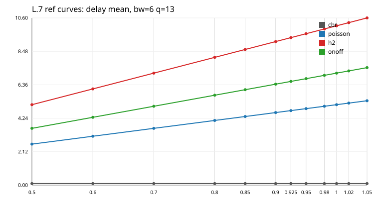
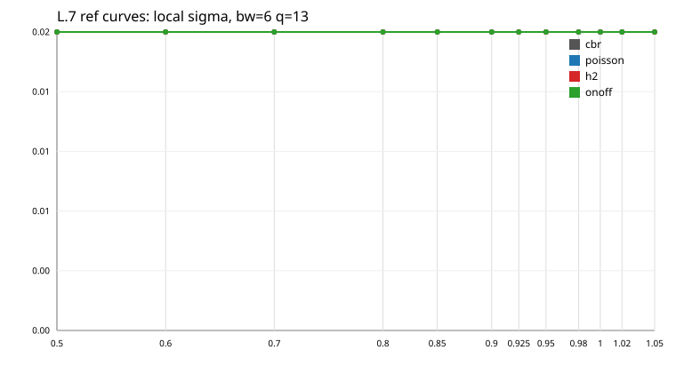
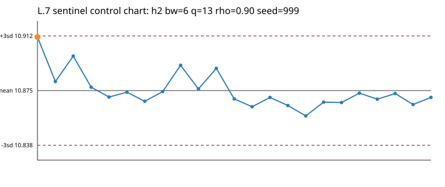
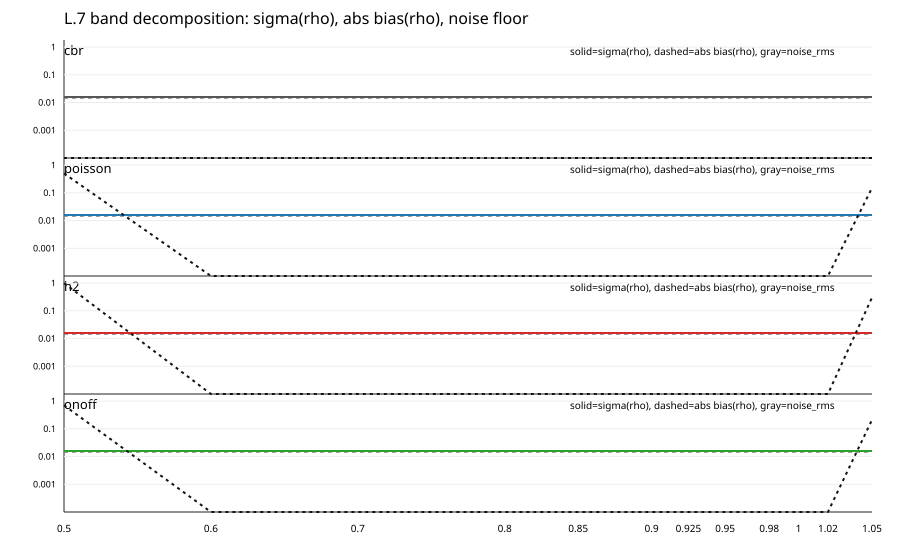

# Phase L / Lesson L.7 -- Fit link_model_v2

Source: `results/phase-L/campaign_state.json`

Output model: `results/phase-L/link_model_v2_fit.json`

## Gates

| gate | result |
|---|---:|
| G-L7a predictive gate | 10/10 PASS |
| G-L7b monotone model | 10/10 PASS |
| G-L7c efficiency | mean 0.77, min 0.18, max 0.98 PASS |
| G-L7d sigma exported | PASS |
| G-L7e rho=1.05 marked extrapolated in held-out | PASS |
| G-L7f sentinel OOS | diff -0.1662 ms, z -0.59 PASS |

## Fit Table

| mode | bw | q | R2 interp | RMSE interp | R2 all | R2 kingman | noise rms | bias rms | sd cv band | efficiency | edge sd | adj max | gate |
|---|---:|---:|---:|---:|---:|---:|---:|---:|---:|---:|---:|---:|---|
| cbr | 4 | 10 | -314701.2199 | 0.6141 | 0.9971 | 0.6831 | 1.1603 | 6.1806 | 6.3233 | 0.18 | 0.3778 | 0.0044 | PASS |
| cbr | 6 | 13 | -5353.7750 | 0.9042 | 0.9940 | 0.7309 | 2.7666 | 4.7340 | 6.5019 | 0.43 | 0.2576 | 0.0059 | PASS |
| cbr | 8 | 18 | -4638.6624 | 1.0389 | 0.9934 | 0.7386 | 1.7274 | 4.9474 | 5.2713 | 0.33 | 0.1463 | 0.0068 | PASS |
| h2 | 4 | 10 | 0.9999 | 0.0338 | 0.9935 | 0.9308 | 0.2679 | 0.0801 | 0.2795 | 0.96 | 1.4802 | 0.0000 | PASS |
| h2 | 6 | 13 | 1.0000 | 0.0138 | 0.9906 | 0.9429 | 0.1943 | 0.0619 | 0.2016 | 0.96 | 1.2063 | 0.0000 | PASS |
| h2 | 8 | 18 | 1.0000 | 0.0201 | 0.9914 | 0.9384 | 0.2221 | 0.0495 | 0.2271 | 0.98 | 1.0612 | 0.0000 | PASS |
| onoff | 6 | 13 | 0.9969 | 0.2891 | 0.9829 | 0.9632 | 0.4847 | 0.1880 | 0.5171 | 0.94 | 0.8686 | 0.0061 | PASS |
| poisson | 4 | 10 | 0.9995 | 0.0943 | 0.9775 | 0.9334 | 0.2187 | 0.0803 | 0.2324 | 0.94 | 1.0815 | 0.0000 | PASS |
| poisson | 6 | 13 | 0.9996 | 0.0795 | 0.9679 | 0.9455 | 0.2595 | 0.0718 | 0.2680 | 0.97 | 1.1206 | 0.0000 | PASS |
| poisson | 8 | 18 | 0.9997 | 0.0695 | 0.9617 | 0.9403 | 0.2291 | 0.0674 | 0.2363 | 0.97 | 1.3621 | 0.0000 | PASS |

CBR uses held-out RMSE instead of R2 because the curve is nearly flat at the software floor.
For CBR, the predictive gate is evaluated only on subcritical held-out rho <= 0.90; the critical shoulder is reported separately because Amendment 6 marked rho near 1 as singular.
Small non-monotone measurement wiggles are projected with weighted isotonic regression before PCHIP; the raw means remain in `delay_observed`.

## Local sigma and LOO bias, bw=6 q=13

| mode | kind | 0.5 | 0.6 | 0.7 | 0.8 | 0.85 | 0.9 | 0.925 | 0.95 | 0.98 | 1 | 1.02 | 1.05 |
|---|---|---:|---:|---:|---:|---:|---:|---:|---:|---:|---:|---:|---:|
| cbr | sigma | 0.004 | 0.003 | 0.006 | 0.005 | 0.005 | 0.003 | 0.008 | 0.009 | 0.080 | 7.377 | 0.028 | 0.034 |
| cbr | bias | 0.000 | 0.000 | -0.000 | 0.000 | 0.000 | 0.000 | 0.000 | 0.004 | 1.566 | 7.331 | -12.958 | -0.487 |
| poisson | sigma | 0.020 | 0.026 | 0.032 | 0.100 | 0.167 | 0.280 | 0.385 | 0.356 | 0.328 | 0.338 | 0.286 | 0.266 |
| poisson | bias | 0.283 | -0.021 | 0.085 | 0.129 | 0.033 | 0.071 | -0.026 | 0.107 | -0.082 | 0.030 | -0.036 | -1.816 |
| h2 | sigma | 0.057 | 0.103 | 0.081 | 0.205 | 0.269 | 0.282 | 0.261 | 0.263 | 0.195 | 0.210 | 0.177 | 0.194 |
| h2 | bias | 1.655 | 0.187 | 0.006 | -0.032 | -0.014 | -0.000 | 0.007 | -0.037 | 0.023 | -0.004 | -0.001 | -0.619 |
| onoff | sigma | 0.004 | 0.003 | 0.004 | 0.627 | 0.632 | 0.584 | 0.563 | 0.738 | 0.648 | 0.554 | 0.395 | 0.317 |
| onoff | bias | 0.000 | 0.000 | 0.465 | 0.281 | -0.163 | 0.158 | -0.002 | -0.003 | -0.065 | 0.023 | -0.050 | -1.601 |

## Sentinel OOS Check

Block E seed 999 is excluded from the fit, so this is a direct out-of-sample check.

| key | n | prediction ms | sentinel mean ms | sentinel sd ms | diff ms | z | result |
|---|---:|---:|---:|---:|---:|---:|---|
| h2\|6\|13 | 23 | 11.0411 | 10.8749 | 0.0122 | -0.1662 | -0.59 | PASS |

## Variance Floor

| quantity | value ms |
|---|---:|
| sigma_machine | 0.0029 |
| sigma_repeat | 0.0096 |
| sigma_schedule | 0.2824 |
| alpha=0.10 half-width floor | 0.4646 |
| schedule variance share | 0.99874 |

## c_a Counterexample at bw=6 q=13 rho=0.90

| mode | c_a mean | c_a sd | q mean ms | q sd ms | Reich mean ms |
|---|---:|---:|---:|---:|---:|
| cbr | 0.0042 | 0.0018 | 0.1330 | 0.0029 | 2.0161 |
| poisson | 1.0032 | 0.0063 | 5.7248 | 0.2800 | 10.7442 |
| h2 | 2.0316 | 0.0208 | 11.0411 | 0.2824 | 35.3998 |
| onoff | 2.3122 | 0.6022 | 6.6310 | 0.5836 | 25.9100 |

Reich/delay correlation across the four modes: `0.9376`.

Conclusion: do not build `f(rho, c_a)`. The deployable model remains conditioned by traffic family.
