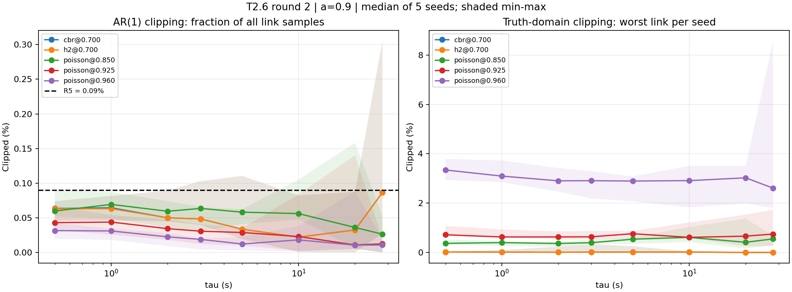

# Kết quả thực hiện T2.6 lượt 2 — 2026-09-08

Đã chạy đủ **166/166 lệnh thành công**, **10,940 dòng** dữ liệu; trong đó 10,400 dòng thuộc lưới và 540 dòng canary. Tổng thời gian các lệnh: **30.57 phút**. Commit thực thi: `d8956cf5650c023c809659aa0c58886b79388b4a`.

## Đã làm gì

- Sửa cả `run_cell` và `fixed_summary_with_bootstrap` để cửa sổ chấm điểm lấy hợp lưới z của hai nhánh; có kiểm tra cửa sổ vượt độ dài trace.
- Tách `tt_domain_clip_max`, `ar1_clip_ratio`, `ar1_cycles`; thêm nhãn `extrapolation_contaminated` ở poisson/h2 tại rho_bar=0.96.
- Cập nhật hai builder cert v2/v3 dùng tên nội bộ mới, giữ schema artifact legacy; bảo toàn kiểu trả về mặc định của nguồn scalar OU.
- Thêm A-T2-1/A-T2-2 và các test hồi quy. **98 test PASS**, gồm **10/10 bit-exact**; môi trường `/home/ubuntu/miniforge3/envs/sdn_rl/bin/python`.
- Giữ nguyên 336 tệp bằng chứng lượt 1 và các artifact thiết kế đã ký, xác minh SHA-256; chạy lượt 2 vào thư mục riêng.
- Thống kê trung vị và min–max qua đúng 5 seed cho toàn bộ 160 ô mode × rho_bar × tau × sigma. Seed canary 999 không tham gia thống kê này.

## Số đo kiểm vệ sinh

| Kiểm tra | Kết quả đo | Phán quyết |
|---|---:|---|
| NC-T2-4 canary | 6 lần; 1 SHA-256; độ lệch 0.0 | PASS |
| NC-T2-2 err_total giữa nhánh | rel_span = 0.0 (lượt 1: 0.0218994872) | PASS |
| rms_e_model giữa nhánh | rel_span = 0.0 | PASS |
| R5: trung vị AR1 lớn nhất toàn lưới | 0.086518% so với 0.09% | PASS |
| R7: trung vị kẹp miền bảng lớn nhất | 3.340500% | Báo cáo; không có ngưỡng đã ký |

Ô R5 có trung vị lớn nhất: `cbr@0.700, tau=28 s, sigma=0.046220930232558126`.

| Ô | Trung vị AR1 lớn nhất | tau tương ứng (s) | Dải 5 seed tại ô đó | Trung vị TT lớn nhất |
|---|---:|---:|---:|---:|
| cbr@0.700 | 0.086518% | 28 | 0.027187–0.305045% | 0.020000% |
| h2@0.700 | 0.086518% | 28 | 0.027187–0.305045% | 0.020000% |
| poisson@0.850 | 0.069312% | 1 | 0.048688–0.087188% | 0.610000% |
| poisson@0.925 | 0.043812% | 1 | 0.025625–0.053938% | 0.759000% |
| poisson@0.960 | 0.031500% | 0.5 | 0.019875–0.042750% | 3.340500% |

Các cột cực trị ở trên lấy trên lưới tau và sigma của từng ô; cực trị TT có thể ở tau khác cực trị AR1. CSV lưu từng ô đầy đủ, tỷ lệ ở đơn vị 0–1. Các số trong bảng này đã nhân 100 thành phần trăm.



Ở cbr@0.700, tau=28, replay 5 seed cho tổng số mẫu kẹp sàn/trần lần lượt: seed 101: 1938/0, seed 102: 2364/0, seed 103: 609/0, seed 104: 6833/0, seed 105: 997/0. Tổng hai phía khớp đúng chẩn đoán `n_clipped`; xem `clip_direction_r2.json`. R5 PASS theo trung vị đã khai, dù một seed riêng lẻ đạt 0.305045% và vượt ngưỡng.

## Đính chính hướng dẫn và giới hạn bước 7

Miền truth table phụ thuộc từng liên kết: poisson/h2 có uA,vC=[0.50,0.96], ad=[0.60,1.04], các liên kết còn lại=[0.50,1.04]; cbr có uA,vC=[0.50,0.85], ad=[0.60,0.95], còn lại=[0.50,0.95]. Test gốc giả định mọi miền giống nhau bị FAIL; đã sửa test theo dữ liệu thật.

Oracle dùng TruthTable, twin dùng mô hình fit LinkModelV2. Vì vậy chưa có bằng chứng để kết luận cả hai bị kẹp giống nhau hoặc thiên lệch err_decision chắc chắn hướng xuống. Vẫn giữ nhãn cảnh báo cho rho_bar=0.96 và không dùng làm headline. Kiểm tra link ad từ rho=1.04 đến 1.05: oracle không đổi, twin tăng 0.471585 ms (poisson) và 0.169263 ms (h2); xem `r7_domain_audit_r2.json`.

Đã tái tạo một ô 22.6 (poisson@0.925, tau=0.5, 5 seed, n=200000/seed), dựng lại 100 hàng phân rã. Công thức `sqrt(rms_e_model² + 2*cov_e + rms_e_stale²)` có sai lệch lớn nhất **7.105e-15**. Hàng ví dụ: RMS lưu và RMS dựng lại cùng bằng **8.235915145897662**. A, c, em tái tạo khớp artifact cũ trong sai số máy.

**Tuy công thức đúng, đại lượng không đồng nhất:** 22.6 đo RMS sai số chênh lệch chi phí giữa hai hành động (có trọng số loss); T2.6 ghi RMS sai số độ trễ trên tất cả hành động. Không thể dùng RMS dựng từ parquet T2.6 để phán quyết các dự đoán ký từ 22.6. Chưa tính đường err(tau), chưa phán quyết các dự đoán vật lý và chưa tính tau_star. Đây là giới hạn công cụ đo được phát hiện trước khi mở các đường kết quả, không phải kết luận FAIL về vật lý. Cần một thiết kế đo cùng đại lượng có dấu vết trước khi xử lý tiếp phần này; không tự đổi ngưỡng, không tái sinh kế hoạch và không chạy lượt sửa thứ hai.

Các số đo đã được điền vào A-T2-1 và commit `1c3a4baf` trước khi ghi trạng thái. Trong 7 mục dự đoán: D-T2.6-5 PASS từ kiểm tra nối nhánh; 6 mục còn lại NOT_EVALUATED. Chưa sử dụng vòng sửa thứ hai.

## Tệp lưu kết quả

- `sweep_r2/*.parquet`: 166 tệp dữ liệu thô, gồm các cột clip mới và các đại lượng đo; `sweep_r2/*_report.json`: báo cáo từng lệnh.
- `sweep_r2/run_log.jsonl`: đủ 166 lệnh, thời gian, mã trả về, SHA-256 và commit thực thi.
- `hygiene_checks_r2.json`: kết quả 3 kiểm vệ sinh; `clip_summary_r2.csv`: trung vị và dải qua 5 seed của toàn lưới.
- `clip_diagnostics_r2.png`: biểu đồ kẹp; `analytic_clip_r2.json`: xác suất AR1 lý thuyết, tách sàn/trần từng link (không thay thế số đo).
- `rms_reference_check_r2.json`, `rms_reference_decomposition_r2.csv`: kiểm tra công thức và xác định khác biệt đại lượng với 22.6.
- `preservation_r2.json`: SHA-256 xác nhận bằng chứng và kế hoạch không đổi.
- `tests_r2.log`, `campaign_r2.log`: output thực tế của pytest và toàn chiến dịch.
- `adjudication_r2.json`: trạng thái dừng đọc; những dự đoán chưa đánh giá ghi NOT_EVALUATED, không dùng null để giả vờ tau_star không tồn tại trên lưới.

## Chạy lại kiểm tra

```bash
/home/ubuntu/miniforge3/envs/sdn_rl/bin/python tools/t2_6_hygiene_r2.py
```
